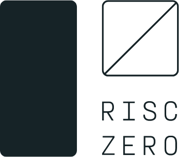

<p align="center">
  <a href="https://risczero.com/#gh-dark-mode-only"></a>
  <a href="https://risczero.com/#gh-light-mode-only"></a>
</p>

<h1 align="center"><a href="https://risczero.com">RISC Zero</a></h1>

[![Crates.io][crates-badge]][crates-url]
[![MIT licensed][licence-badge]][licence-url]
[![Build Status][actions-badge]][actions-url]
[![Discord chat][discord-badge]][discord-url]
[![Twitter][twitter-badge]][twitter-url]

[crates-badge]: https://img.shields.io/badge/crates.io-v0.13-orange
[crates-url]: https://crates.io/crates/risc0-zkvm
[licence-badge]: https://img.shields.io/github/license/risc0/risc0?color=blue
[licence-url]: https://github.com/risc0/risc0/blob/main/LICENSE
[actions-badge]: https://img.shields.io/github/actions/workflow/status/risc0/risc0/main.yml?branch=main
[actions-url]: https://github.com/risc0/risc0/actions?query=workflow%3ACI+branch%3Amain
[discord-badge]: https://img.shields.io/discord/953703904086994974.svg?logo=discord&style=flat-square
[discord-url]: https://discord.gg/risczero
[twitter-badge]: https://img.shields.io/twitter/follow/risczero
[twitter-url]: https://twitter.com/risczero

[zk-proof]: https://en.wikipedia.org/wiki/Non-interactive_zero-knowledge_proof
[risc-v]: https://en.wikipedia.org/wiki/RISC-V
[crates.io]: https://crates.io

> WARNING: This software is still experimental, we do not recommend it for
> production use (see Security section).

RISC Zero is a zero-knowledge verifiable general computing platform based on
[zk-STARKs][zk-proof] and the [RISC-V] microarchitecture.

A [zero knowledge proof][zk-proof] allows one party (the prover) to convince
another party (the verifier) that something is true without revealing all the
details.  In the case of RISC Zero, the prover can show they correctly executed
some code (known to both parties), while only revealing to the verifier the
output of the code, not any of its inputs or any state during execution.

The code runs in a special virtual machine, called a *zkVM*.  The RISC Zero zkVM
emulates a small [RISC-V] computer, allowing it to run arbitrary code in any
language, so long as a compiler toolchain exists that targets RISC-V. Currently,
SDK support exists for Rust, C, and C++.

## Protocol overview and terminology

First, the code to be proven must be compiled from its implementation language
into a *method*.  A method is represented by a RISC-V ELF file with a special
entry point that runs the code of the method.  Additionally, one can compute for
a given method its *image ID* which is a special type of cryptographic hash of
the ELF file, and is required for verification.

Next, the prover runs the method inside the zkVM.  The logical RISC-V machine
running inside the zkVM is called the *guest* and the prover running the zkVM is
called the *host*.  The guest and the host can communicate with each other
during the execution of the method, but the host cannot modify the execution of
the guest in any way, or the proof being generated will be invalid. During
execution, the guest code can write to a special append-only log called the
*journal* that represents the official output of the computation.

Presuming the method terminated correctly, a *receipt* is produced, which
provides the proof of correct execution. This receipt consists of 2 parts: the
journal written during execution and a blob of opaque cryptographic data called
the *seal*.

The verifier can then verify the receipt and examine the log. If any tampering
was done to the journal or the seal, the receipt will fail to verify.
Additionally, it is cryptographically infeasible to generate a valid receipt
unless the output of the journal is the exactly correct output for some valid
execution of the method whose image ID matches the receipt. In summary, the
receipt acts as a zero knowledge proof of correct execution.

Because the protocol is zero knowledge, the verifier cannot infer anything about
the details of the execution or any data passed between the host and the guest
(aside from what is implied by the data written to the journal and the correct
execution of the code).

## Security

This code is based on the well studied zk-STARK protocol, which has been proven
secure under the random oracle model, with the only assumption being the
security of the cryptographic hash used.  Our implementation uses SHA-256 for
that hash and targets 100 bits of security.

That said, this code is still under heavy development and has not been audited.
There may be bugs in the zk-STARK implementation, the arithmetic circuit used to
instantiate the RISC-V zkVM, or any other element of the code's implementation.
Such bugs may impact the security of receipts, leak information, or cause any
other manner of problems.  Caveat emptor.

## Getting Started

To get started building applications using the zkVM in Rust, we provide a
[starter template](https://github.com/risc0/risc0-rust-starter) and a
number of [working examples](https://github.com/risc0/risc0-rust-examples/).

## Example

Add a `methods` crate, which will act as a container for code that runs within
the zkVM. This crate will be configured with a special build-script to enable
cross-compilation of RISC-V code. The resulting ELF binary will be embedded
within this crate so that it can be referenced as a dependency in your
application.

```
cargo new --lib methods
```

Adjust `methods/Cargo.toml` to include:

```toml
[build-dependencies]
risc0-build = "0.13"

[package.metadata.risc0]
methods = ["guest"]
```

Adjust `methods/src/lib.rs` so that its contents are:

```rust
include!(concat!(env!("OUT_DIR"), "/methods.rs"));
```

Add a `methods/build.rs` build script with these contents:

```rust
fn main() {
  risc0_build::embed_methods();
}
```

Within the `methods` crate, create a `guest` crate. Rename the `main.rs` to
something more appropriate.

```
cargo new --bin methods/guest
mv methods/guest/main.rs methods/guest/example.rs
```

Add `risc0-zkvm` to the `methods/guest/Cargo.toml` file:

```toml
[dependencies]
risc0-zkvm = { version = "0.13", default-features = false }
```

Edit the code in `methods/guest/src/example.rs`:

```rust
#![no_main]
#![no_std]

risc0_zkvm::guest::entry!(main);

pub fn main() {
    // TODO: Implement your guest code here
}
```

Add `risc0-zkvm` and the `methods` crate to your dependencies:

```toml
[dependencies]
methods = { path = "methods" }
risc0-zkvm = "0.13"
```

Call the prover from your application:

```rust
use methods::{EXAMPLE_ELF, EXAMPLE_ID};
use risc0_zkvm::Prover;

fn main() {
  let mut prover = Prover::new(EXAMPLE_ELF, EXAMPLE_ID).unwrap();
  let receipt = prover.run().unwrap();

  // The receipt can be sent to another party, where they can:

  receipt.verify(EXAMPLE_ID).unwrap();
}
```

## Rust Binaries

| crate       | [crates.io]                                                                                       |
| ----------- | ------------------------------------------------------------------------------------------------- |
| risc0-r0vm  | [](https://crates.io/crates/risc0-r0vm)  |
| risc0-tools | [](https://crates.io/crates/risc0-tools) |

## Rust Libraries

| crate                | [crates.io]                                                                                                | [docs.rs](https://docs.rs)                                                                      |
| -------------------- | ---------------------------------------------------------------------------------------------------------- | ----------------------------------------------------------------------------------------------- |
| risc0-build          | [](https://crates.io/crates/risc0-build)          | [](https://docs.rs/risc0-build)                   |
| risc0-build-kernel   | [](https://crates.io/crates/risc0-build-kernel)   | [](https://docs.rs/risc0-build-kernel)     |
| risc0-circuit-rv32im | [](https://crates.io/crates/risc0-circuit-rv32im) | [](https://docs.rs/risc0-circuit-rv32im) |
| risc0-core           | [](https://crates.io/crates/risc0-core)           | [](https://docs.rs/risc0-core)                     |
| risc0-sys            | [](https://crates.io/crates/risc0-sys)            | [](https://docs.rs/risc0-sys)                       |
| risc0-zeroio         | [](https://crates.io/crates/risc0-zeroio)         | [](https://docs.rs/risc0-zeroio)                 |
| risc0-zeroio-derive  | [](https://crates.io/crates/risc0-zeroio-derive)  | [](https://docs.rs/risc0-zeroio-derive)   |
| risc0-zkp            | [](https://crates.io/crates/risc0-zkp)            | [](https://docs.rs/risc0-zkp)                       |
| risc0-zkvm           | [](https://crates.io/crates/risc0-zkvm)           | [](https://docs.rs/risc0-zkvm)                     |
| risc0-zkvm-platform  | [](https://crates.io/crates/risc0-zkvm-platform)  | [](https://docs.rs/risc0-zkvm-platform)   |

## Cargo Risczero tool

Included is a tool to manage risczero project directories

```bash
# Installing from local source
cargo install --path risc0/cargo-risczero
# Install from crates.io
cargo install cargo-risczero
```

## License

This project is licensed under the Apache2 license. See [LICENSE](LICENSE).
