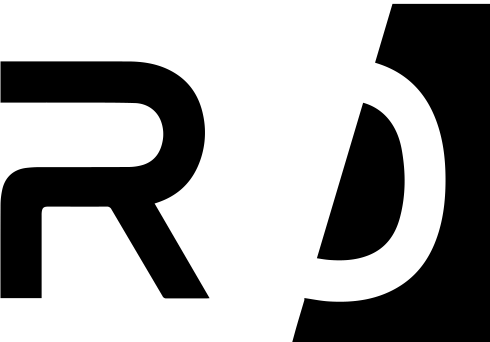

  
  

<h1 align="center">RISC Zero</h1>

  
  

> WARNING: This software is still experimental, we do not recommend it for
> production use (see Security section).

RISC Zero is a zero-knowledge verifiable general computing platform based on
zk-STARKs and the RISC-V microarchitecture.

A [zero knowledge proof](https://en.wikipedia.org/wiki/Non-interactive_zero-knowledge_proof) allows one party (the prover) to convince another party
(the verifier) that something is true without revealing all the details.  In
the case of RISC Zero, the prover can show they correctly executed some code
(known to both parties), while only revealing to the verifier the output of the
code, not any of its inputs or any state during execution.

The code runs in a special virtual machine, called a *zkVM*.  The RISC Zero
zkVM emulates a small [RISC-V](https://en.wikipedia.org/wiki/RISC-V) computer, allowing it to run arbitrary code in any
language, so long as a compiler toolchain exists that targets RISC-V.
Currently, SDK support exists for Rust, C, and C++.

## Protocol overview and terminology

First, the code to be proven must be compiled from its implementation language
into a *method*.  A method is represented by a RISC-V ELF file with a special
entry point that runs the code of the method.  Additionally, one can compute
for a given method its *method ID* which is a special type of
cryptographic hash of the ELF file, and is required for verification.

Next, the prover runs the method inside the zkVM.  The logical RISC-V machine
running inside the zkVM is called the *guest* and the prover running the zkVM
is called the *host*.  The guest and the host can communicate with each other
during the execution of the method, but the host cannot modify the execution of
the guest in any way, or the proof being generated will be invalid. During
execution, the guest code can write to a special append-only log called the
*journal* that represents the official output of the computation.

Presuming the method terminated correctly, a *receipt* is produced, which
provides the proof of correct execution. This receipt consists of 2 parts:
the journal written during execution and a blob of opaque cryptographic
data called the *seal*.

The verifier can then verify the receipt and examine the log. If any
tampering was done to the journal or the seal, the receipt will
fail to verify.  Additionally, it is cryptographically infeasible to generate a
valid receipt unless the output of the journal is the exactly correct output
for some valid execution of the method whose method ID matches the receipt.
In summary, the receipt acts as a zero knowledge proof of correct execution.

Because the protocol is zero knowledge, the verifier cannot infer
anything about the details of the execution or any data passed between the host
and the guest (aside from what is implied by the data written to the journal
and the correct execution of the code).

## Security

This code is based on the well studied zk-STARK protocol, which has been proven
secure under the random oracle model, with the only assumption being the
security of the cryptographic hash used.  Our implementation uses SHA-256 for
that hash and targets 100 bits of security.

That said, this code is still under heavy development and has not been
audited.  There may be bugs in the zk-STARK implementation, the arithmetic
circuit used to instantiate the RISC-V zkVM, or any other element of the code's
implementation.  Such bugs may impact the security of receipts, leak
information, or cause any other manner of problems.  Caveat emptor.

## Getting Started

To get started building applications using the zkVM in Rust, we provide
a small 'Hello World' repository here:

[risc0-rust-starter](https://github.com/risc0/risc0-rust-starter)

Additionally, we have a more complex battleship example here:

[battleship-example](https://github.com/risc0/battleship-example)

## Rust Binaries

| crate       | [crates.io](https://crates.io)                                                            |
| ----------- | ----------------------------------------------------------------------------------------- |
| risc0-r0vm  |    |
| risc0-tools |  |

## Rust Libraries

| crate                | [crates.io](https://crates.io)                                                                              | [docs.rs](https://docs.rs)                                                                      |
| -------------------- | ----------------------------------------------------------------------------------------------------------- | ----------------------------------------------------------------------------------------------- |
| risc0-build          |                    |                    |
| risc0-circuit-rv32im |  |  |
| risc0-zeroio         |                  |                  |
| risc0-zeroio-derive  |    |    |
| risc0-zkp            |                        |                        |
| risc0-zkvm           |                      |                      |
| risc0-zkvm-platform  |    |    |

## Building RISC Zero

TODO
