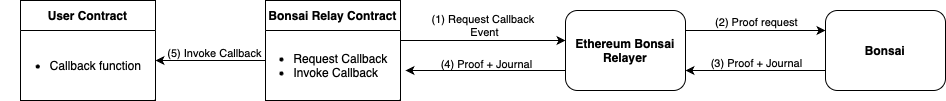

# Bonsai Ethereum Relay

This repository provides the `bonsai-ethereum-relay`, a tool to integrate Ethereum with Bonsai.
It is coupled with an Ethereum Smart Contract able to relay the interaction from Ethereum to Bonsai and vice versa.

## Overview

The picture below shows a simplified overview of how users can integrate Bonsai into their Ethereum smart contracts:



1. Some user's logic execution of a given user smart contract gets delegated to be executed and proven on Bonsai.
   The [Bonsai Relay Contract](../ethereum/contracts/BonsaiRelay.sol) exposes an interface `Request Callback` that triggers an event that is caught by the `Ethereum Bonsai Relayer`.
2. The relayer forwards the proof request to Bonsai.
3. The relayer queries Bonsai to get a Snark proof of the requested computation as well as its result embedded into a journal.
4. Both proof and journal are sent on-chain to the `Bonsai Relay Contract`, that verifies the correctness of the proof.
5. Upon successful verification, the journal gets sent to the user contract via the specified callback function.

## Interfaces

The Bonsai Ethereum Relay provides both an *on-chain* (via Ethereum) and an *off-chain* (via HTTP REST API) interface to send `Callback requests`.

### On-chain

A typical flow works as follows:

1. Deploy a Bonsai Relay Smart Contract on Ethereum at a given address `0xB..`.
2. Start an instance of the relay tool configured with the option `--contract-address` defined as `0xB..`.
3. Delegate some off-chain computation for a given Smart Contract `A` to Bonsai by registering the `Image` or `ELF` (i.e., the compiled binary responsible for executing the given computation on the RISC Zero ZKVM) to Bonsai.
4. The corresponding `Image ID` and the Bonsai Relay Smart Contract `0xB..` can be used to construct and deploy the Smart Contract `A` to Ethereum.
5. Send a transaction to Smart Contract `A` to trigger a `Callback request` event that the Bonsai Relay will catch and forward to Bonsai.
6. Once Bonsai has generated a proof of execution, the Bonsai Relay will forward this proof along with the result of the computation to the Bonsai Relay Smart Contract.
7. This triggers a verification of the proof on-chain, and only upon successful verification, the result of the computation will be forwarded to the original requester Smart Contract `A` via the `invoke_callback` function.

### REST API

As an alternative to sending a `Callback request` from Ethereum as described by step 5, the request can be sent directly to the Bonsai Relay via an HTTP REST API.
Then, the remaining steps will flow as above. The following example explains how to do that.

#### Example

The following example assumes that the Bonsai Relay is up and running with the server API enabled,
and that the memory image of your `ELF` is already registered against Bonsai with a given `IMAGE_ID` as its identifier.

<!-- TODO(victor): Rework this example to make it actually build and run -->
```rust,ignore
// initialize a relay client
let relay_client = Client::from_parts(
        "http://localhost:8080".to_string(), // here goes the actual url of the Bonsai Relay
        "BONSAI_API_KEY" // here goes the actual Bonsai API-Key
    )
    .expect("Failed to initialize the relay client");

// Initialize the input for the guest.
// In this example we are sending a slice of bytes,
// where the first 4 bytes represents the length
// of the slice (in little endian).
let mut input = vec![0; 36];
input[0] = 32;
input[35] = 100;

// Create a CallbackRequest for the your contract
// example: (tests/contracts/Counter.sol).
let image_id: [u8; 32] = bytemuck::cast(IMAGE_ID);
let request = CallbackRequest {
    callback_contract: counter.address(),
    // you can use the command `solc --hashes tests/solidity/contracts/Counter.sol`
    // to get the value for your actual contract
    function_selector: [0xff, 0x58, 0x5c, 0xaf],
    gas_limit: 3000000,
    image_id,
    input,
};

// Send the callback request to the Bonsai Relay.
// On success, the Relay will return the Bonsai session ID.
let session_id = relay_client
    .callback_request(request)
    .await
    .expect("Callback request failed");

```

## Usage

```console
A relayer to integrate Ethereum with Bonsai.

Usage: bonsai-ethereum-relay [OPTIONS] --contract-address <CONTRACT_ADDRESS> --eth-node-url <ETH_NODE_URL> --wallet-key-identifier <WALLET_KEY_IDENTIFIER>

Options:
  -p, --port <PORT>
          The port of the relay REST API [default: 8080]
      --rest-api
          Toggle to disable the relay REST API
      --contract-address <CONTRACT_ADDRESS>
          Bonsai Relay contract address on Ethereum
      --eth-node-url <ETH_NODE_URL>
          Ethereum Node endpoint
      --eth-chain-id <ETH_CHAIN_ID>
          Ethereum chain ID [default: 5]
  -w, --wallet-key-identifier <WALLET_KEY_IDENTIFIER>
          Wallet Key Identifier. Can be a private key as a hex string, or an AWS KMS key identifier [env: WALLET_KEY_IDENTIFIER=]
      --bonsai-api-url <BONSAI_API_URL>
          Bonsai API URL [env: BONSAI_API_URL=http://localhost:8081] [default: http://localhost:8081]
      --bonsai-api-key <BONSAI_API_KEY>
          Bonsai API Key Defaults to empty, providing no authentication [env: BONSAI_API_KEY=none] [default: ]
      --risc0-dev-mode
          Toggle to enable dev_mode: only a local executor runs your zkVM program and no proof is generated [env: RISC0_DEV_MODE=]
  -h, --help
          Print help
  -V, --version
          Print version
```

### Dev Mode

To support faster development, the `Ethereum Bonsai Relay` provides a `dev-mode`.
In `dev-mode`, a mock of the Bonsai proving service will be used provides only the journal of a given executing, without any cryptographic proof.
Since execution is much faster than proving, this mode can be used to speed-up testing and debugging.

Enable `dev-mode` setting the environmental variable `RISC0_DEV_MODE=true` when starting the relayer.
Since there are no proofs within this mode, we also provide a [Bonsai Test Relay Contract](../ethereum/contracts/BonsaiTestRelay.sol) that skips the on-chain verification of the snark proof.
