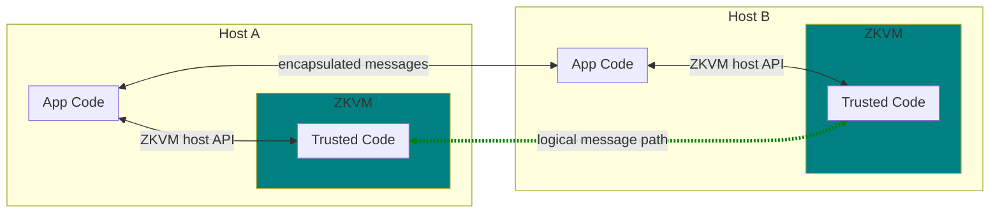
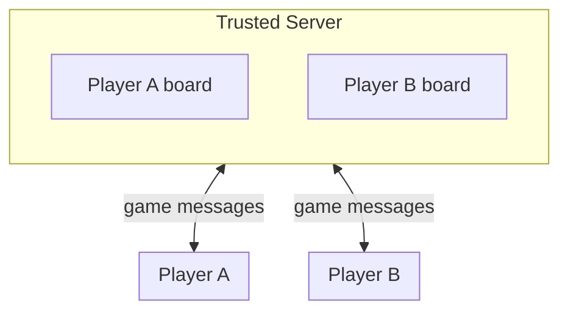
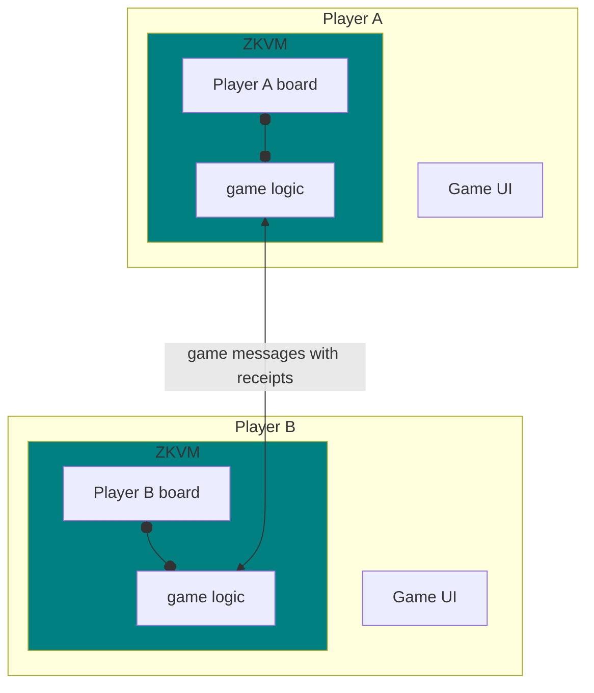
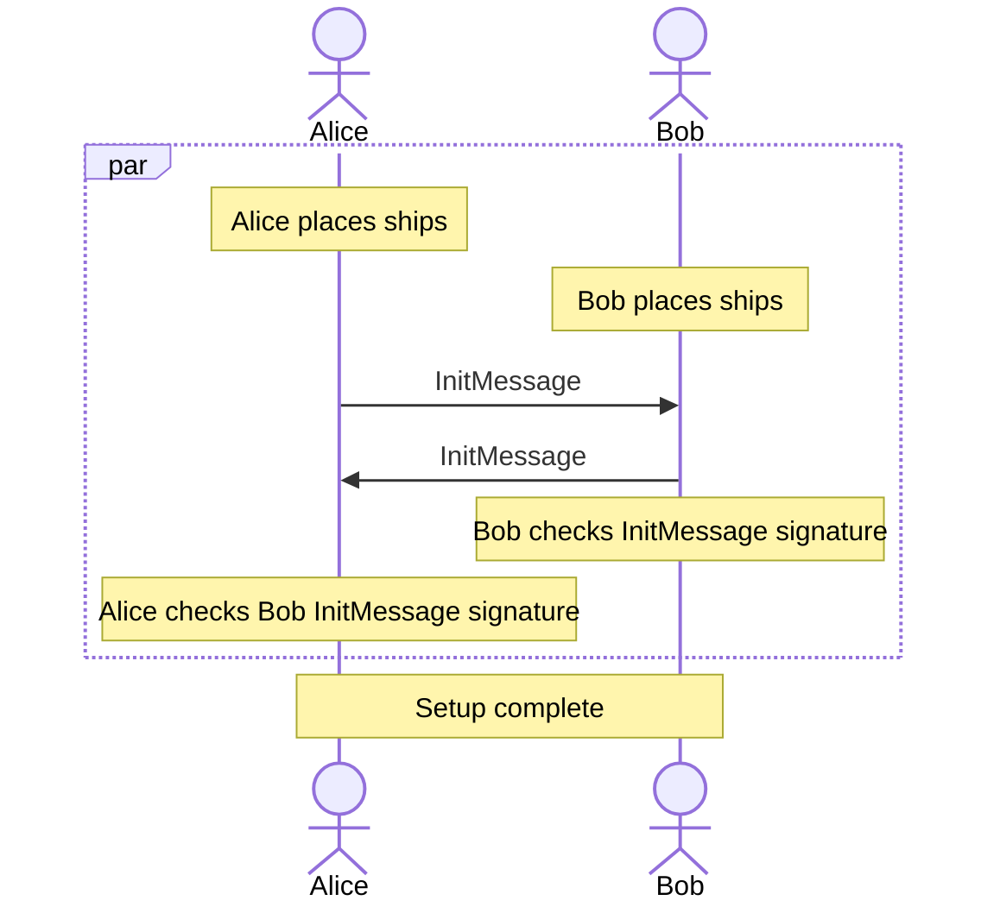

# Battleship on RISC Zero

*revised Apr 18, 2021*

## Summary

In this introduction to RISC Zero's technology we outline how to implement a secure, decentralized version of the game *Battleship* using Rust and RISC Zero's Zero Knowledge Virtual Machine (ZKVM). Battleship relies on each player being able to *conceal* the ships on their private game board from their opponent while receiving *accurate* reports from their opponent on the effect of their shots. In a traditional networked application this would be solved by introducing a trusted server to mediate play and hold the game state, and this is representative of existing traditional computing systems. In this implementation we apply the power of *zero knowledge proofs* (ZKPs) using the ZKVM to build a server-free version of Battleship in Rust. The players each maintain their private game state, yet every step of the game is cryptographically checked to prevent cheating. The patterns in this code may be applied to build new secure, decentralized applications in finance, governance, information security, etc.

## What is RISC Zero?

RISC Zero is a startup building the RISC Zero ZKVM, a major step towards improving the security and trustworthiness of distributed applications. RISC Zero ZKVM (from here on referred to as the "VM") bridges the gap between zero knowledge proof (ZKP) research and widely-supported programming languages such as C++ and Rust. ZKP technology enables programs' output to carry proof of provenance and correct execution that can be cryptographically verified by a receiver without access to the programs' inputs. Stripping away the jargon this means the output of the program can be checked for correctness without seeing the inputs. This verifiability enables decentralization of applications that previously required a trusted third party, a game changer for the resilience and economics of operating the computing infrastructure that we all rely on.

Foundational work on SNARKs and STARKs shows the potential of ZKP-based compute, but to date building applications has required adopting new programming languages with sparse tooling support. RISC Zero is removing those barriers by bringing existing languages, tools, and developer skills to ZKP development. The way RISC Zero achieves this is by inventing a uniquely high-performance ZKP prover and then using the performance headroom to build a zero knowledge virtual machine (ZKVM) implementing a standard RISC-V instruction set. While difficult, emulating RISC-V makes possible compatibility with existing mature languages and toolchains. In concrete terms this looks like seamless integration between "host" application code written in a high level language running natively on the host processor (e.g. Rust on arm64 Mac) and "guest" code in the same language executing inside our ZKVM (e.g. Rust on RISC-V, specifically RV32IM). This is similar to the very successful pattern used in Nvidia's CUDA C++ toolchain, but with a ZKP engine in place of a GPU.

More detailed technical and theoretical materials are available by request.
<!-- TODO either release paper or put e-mail address here -->

## Battleship gameplay

In this example we'll walk through an implementation of the popular two-player game Battleship. Typically played in person with concealed physical game boards, a networked version of the game relies on each party accurately reporting the results of play based on their private board state. Allowing mutually untrusting players to play together requires a mechanism to gain trust in the integrity of gameplay, while the complexity of the game logic benefits from implementation in a mature high-level language. In this way Battleship is a microcosm of the challenges in implementing more complex multi-party limited trust applications.


### Game background

The game starts with two players, each placing their ships on their private board of square grid cells. After placement the ships remain stationery and players take turns attempting to sink them by shelling grid cells until a player has won by sinking their opponent's ships. Each turn consists of a message exchange, or "round", where a player fires at coordinates on their opponent's board followed by an acknowledgement from the other player containing information about hit or miss, and if a ship has been sunk. Players alternate turns until a player has lost all their ships, ending the game.

See [Wikipedia: Battleship_(game)](https://en.wikipedia.org/wiki/Battleship_(game)) for details on the game's history and rules.

### Security properties

For this implementation of Battleship we'll be providing the following security properties:

- Each player starts the game with the right set of ships placed on their board, no more or fewer (valid setup).
- No player changes their ship placement during the game.
- Each shot acknowledgement contains an accurate report on whether the shell hit a ship and if so whether a ship sunk.
- Each player's ship placement is confidential during the all message exchanges.

In this implementation the game is implemented as two parallel guessing games, it is not possible to prove the game outcome after the fact. Extending the example to support proving game outcome would make the code a little bit more complicated but wouldn't require any new features from the underlying platform.

## Quick start

To run the example code yourself you'll need a working build of RISC Zero. RISC Zero works on recent Linux, Mac, or Windows and requires around 5GB free space and seven minutes to do a clean build (tested on a MacBook Air). Head over to the main [RISC Zero GitHub repo](https://github.com/risc0/risc0) and follow the instructions in the [README.md](https://github.com/risc0/risc0/blob/main/README.md). 

Included in the README is the command to run the Battleship Rust example:

```

RISC0_LOG=1 bazelisk run //examples/rust/battleship:test

```

Running that you should see a lot of debug output ending in a `cargo test` status line similar to below:

```

...
[2022-03-25T20:10:36Z INFO  test] on_round_msg
15.091 (0.002): Reading code id from examples/rust/battleship/proof/turn.id
15.091 (0.000): size = 32768
15.091 (0.000): codeRoot = 8cc48fdcb89c54206c953a070ce9eb199077432ea6a91069413f0e43ee182ee2
15.091 (0.000): dataRoot = 73f950aa4c016353432983182eacbe169bbcaf19db37a3ff637fcf168c4c722c
15.091 (0.000): accumRoot = 150cec08d393b3da406d0c3fa53b79580367c65561d8a3482a60206f75107780
15.091 (0.000): checkRoot = 73e704f2ad051b56710ee19c8f91a751a4c06b85fe13db31b9449ea12d0d71ae
15.091 (0.000): Z = 1838642559+1853296143x+742650868x^2+853030345x^3
15.092 (0.000): Result = 282643219+1641085643x+302170905x^2+186456821x^3
15.092 (0.000): Check = 282643219+1641085643x+302170905x^2+186456821x^3
15.092 (0.000): mix = 1444325494+34230134x+128629049x^2+1427073193x^3
15.092 (0.000): FRI-verify, size = 32768
[2022-03-25T20:10:36Z INFO  test]   commit: RoundCommit { old_state: cd3cbe55c93d4b7b125cb4eddb5ac6b65e3768b433dbacd4b17be5d4df1b9d9b, new_state: c9ee63e880dcfa195bc55d61f6ccf94744154377db7a6ffe1f29049a0cbee6ec, shot: Position { x: 6, y: 1 }, hit: Sunk(1) }
test tests::protocol ... ok

test result: ok. 2 passed; 0 failed; 0 ignored; 0 measured; 0 filtered out; finished in 15.09s
```

If you run into any problems feel free to ask on [Discord](https://discord.gg/risczero) and check [GitHub Issues](https://github.com/risc0/risc0/issues).

## RISC Zero operation

### Key terminology

- *ZKVM* -- a virtual machine that runs trusted code and generates proofs
- *RISC Zero ZKVM* -- RISC Zero's ZKVM implementation based on the RISC-V architecture
- *host* -- the system the ZKVM runs on
- *guest* -- the system running inside the ZKVM
- *host* program -- the host-native, untrusted portion of an application
- *prover* -- a program on the host that runs the trusted code to generate a receipt
- *verifier* -- a program on the host that verifies receipts
- *method* -- a single 'main' entry point for code that runs inside the ZKVM
- *execute* -- run a method inside the ZKVM and produce a receipt of correct execution
- *commit* -- append data to the journal
- *receipt* -- a record of correct execution, consisting of:
  - *method ID* -- a small unique identifier that identifies a method
  - *journal* -- all the things the method wants to publicly output and commit to, written to by the method, attached to receipt
  - *seal* -- the cryptographic blob which proves that the receipt is valid
- *verify* -- check that the receipt is valid, i.e. verify the seal
- theoretical nomenclature used in papers and internals of RISC Zero's ZKVM implementation
  - *proof* -- the seal
  - *circuit* -- a mathematical construct that appears in one view as the "CPU" in the ZKVM but on the other is part of the computation used to create proofs

### Operation overview



The key thing verifiable computation brings to decentralized apps is the ability to distribute trusted logic across peers without relying on a server. Within RISC Zero's approach this is done by putting that logic into an embedded program called the *guest* that runs within a ZKVM hosted inside the user-facing application. During operation a host program *executes* *methods* on the *guest* to manipulate the guest's internal state. As the guest program executes it may *commit* outputs to transmit to the *journal*. When execution finishes the ZKVM returns to the host program a *receipt* containing the committed journal items along with a cryptographic *seal* that proves the integrity of the result. This receipt can then be sent across a network to another host where the receipt may be checked by the *verifier* and used for further computation.

To see this in action let's look at the Battleship implementation.

## Battleship on RISC Zero ZKVM

As mentioned earlier a traditional pre-ZKP approach to building networked Battleship would be to have both players send commands to a trusted server that runs the game logic.

*Traditional networked Battleship design:*



In contrast in the server-free version using ZKPs the clients communicate directly with each other and use cryptographic verification of the receipts they receive to protect the integrity of the game.

*ZKP-secured networked Battleship design:*



Each turn a player fires a shot and the opponent responds, with game logic running inside a ZKVM players are able to verify the accuracy of each response. The code implementing this lives in the [risc0 repo](https://github.com/risc0/risc0) under [examples/rust/battleship](https://github.com/risc0/risc0/tree/battleship-tutorial/examples/rust/battleship). 

- README.md -- overview & build instructions
- BUILD.bazel -- Bazel build rules for the host code.
- src/lib.rs -- The overall flow of the game turns is here, along with the Cargo functional tests. This could be extended a GUI interface etc.
- src/main.rs -- A placeholder for now.
- core/BUILD.bazel -- Bazel build rules for the guest code (trusted game logic).
- core/src/lib.rs -- The game logic is here, along with functions for checking validity of game boards, and some unit tests for game logic.
- core/src/bin/init.rs -- The ZKVM guest method for initializing game state.
- core/src/bin/turn.rs -- The ZKVM guest method for processing gameplay messages.

You can cross-reference the usage of our Rust API with the host-side API implementation in [risc0/zkvm/sdk/rust/host/src/lib.rs](https://github.com/risc0/risc0/blob/main/risc0/zkvm/sdk/rust/host/src/lib.rs). Thanks to the single-language approach the types and logic in core/src/lib.rs can be used in both the guest code and host code even though they deploy to different instruction sets and in very different environments. 

### Valid Setup

The first important security property in Battleship is that the players can trust that their opponents have set up the game boards fairly and correctly, for example that they've placed all of their ships on the board. As noted earlier players can do setup in parallel and then transmit a receipt of the setup computation (but not the board state!).

<!-- TODO below only renders in newer versions of Mermaid than what Homebrew ships -->


The main source for the host program that runs the game is located in [`src/lib.rs`](https://github.com/risc0/risc0/blob/battleship-tutorial/examples/rust/battleship/src/lib.rs). Each instance is built around a core `Battleship` [`src/lib.rs:34`](https://github.com/risc0/risc0/blob/battleship-tutorial/examples/rust/battleship/src/lib.rs#L34) struct that holds the local game state and a `Digest` of the opponent's game state.

```
pub struct Battleship {
    state: GameState,
    last_shot: Position,
    peer_state: Digest,
}
```

To initialize Alice creates GameState with ship placements, then calls .init() to produce the InitMessage to send to Bob.

[`src/lib.rs:182`](https://github.com/risc0/risc0/blob/battleship-tutorial/examples/rust/battleship/src/lib.rs#L182)

```
        let alice_state = GameState {
            ships: [
                Ship::new(2, 3, ShipDirection::Vertical),
                Ship::new(3, 1, ShipDirection::Horizontal),
                Ship::new(4, 7, ShipDirection::Vertical),
                Ship::new(7, 5, ShipDirection::Horizontal),
                Ship::new(7, 7, ShipDirection::Horizontal),
            ],
            salt: 0xDEADBEEF,
        };

        let mut alice = Battleship::new(alice_state);
        alice.init();  // produces InitMessage
```

Here's what an InitMessage looks like. Note it's just a receipt of the opposing board state, it doesn't contain the board itself!

[`src/lib.rs:20`](https://github.com/risc0/risc0/blob/battleship-tutorial/examples/rust/battleship/src/lib.rs#L20)
```
pub struct InitMessage {
    receipt: Receipt,
}
```

This is important because this allows Alice to prove to Bob her board is set up fairly without sharing the contents. Instead of sharing the board the receipt only tells Bob that the board was verified to have valid (fair) ship placement. Let's look at how that happens. Alice's instance of the host program does this by calling `Battleship.init()` to generate an `InitMessage`, then sends the result to Bob. 

[`src/lib.rs:63`](https://github.com/risc0/risc0/blob/battleship-tutorial/examples/rust/battleship/src/lib.rs#L63)

```
    pub fn init(&self) -> Result<InitMessage> {
        let mut prover = Prover::new("examples/rust/battleship/core/init")?;
        let vec = to_vec(&self.state).unwrap();
        prover.add_input(vec.as_slice())?;
        let receipt = prover.run()?;
        Ok(InitMessage { receipt })
    }
```
The magic is in how the message gets constructed. To see what is happening we follow the `prover.run()` call to the `.../core/init` guest method which maps to execution of the `core/src/bin/init.rs:main()`:

[`core/src/bin/init.rs:24`](https://github.com/risc0/risc0/blob/battleship-tutorial/examples/rust/battleship/core/src/bin/init.rs#L24)

```
pub fn main() {
    let state: GameState = env::read();
    if !state.check() {
        panic!("Invalid GameState");
    }
    env::commit(&sha::digest(state));
}
```

It's important to understand that this code runs inside the ZKVM. The VM API serializes the `GameState`, boots the `.../core/init` code inside a new VM, and our libraries then receive and deserialize the data for use by an app's guest-side logic. Conveniently, because the host and guest are written in the same language they can actually share source code. Once running, the guest code checks the `GameState` for validity according to the logic in `GameState.check()` ([`core/src/lib.rs:89`](https://github.com/risc0/risc0/blob/battleship-tutorial/examples/rust/battleship/core/src/lib.rs#L89)) and then `commit`s the VM's state, generating a receipt for transmission to Bob.

When Bob receives the `InitMessage` from Alice his Battleship passes it to the `on_init_message()` message handler (below). This verifies the integrity of the message and if it is valid stores the `Digest`. The host-side portion of the code is brief, and unlike on the send side the actual `.../core/init` method is never run. Instead the RISC Zero verifier checks only that the receipt is the output of a valid execution of the `.../core/init` method.

```
    pub fn on_init_msg(&mut self, msg: &InitMessage) -> Result<()> {
        log::info!("on_init_msg");
        msg.receipt.verify("examples/rust/battleship/core/init")?;
        self.peer_state = msg.get_state()?;
        log::info!("  peer_state: {:?}", self.peer_state);
        Ok(())
    }
```

Bob generates and returns an InitMessage, which Alice verifies in the same way, and play can begin.

### Valid turn

Once the game is set up fairly the next property to ensure is that turns are processed fairly. The initialization process above gives a good idea about the general way the ZKVM and receipts are used, but turns add new wrinkles. Alice starts a turn by creating a `TurnMessage` containing a shot as described by coordinates to shell. This does not pass through the ZKVM but we do store the shot for future reference.

[`src/lib.rs:79`](https://github.com/risc0/risc0/blob/battleship-tutorial/examples/rust/battleship/src/lib.rs#L79)
```
    pub fn turn(&mut self, x: u32, y: u32) -> TurnMessage {
        let shot = Position::new(x, y);
        self.last_shot = shot.clone();
        TurnMessage { shot: shot.clone() }
    }
```

When Bob receives the TurnMessage he passes it to `on_turn_msg()`:

[`src/lib.rs:86`](https://github.com/risc0/risc0/blob/battleship-tutorial/examples/rust/battleship/src/lib.rs#L86)
```
    pub fn on_turn_msg(&mut self, msg: &TurnMessage) -> Result<RoundMessage> {
        let params = RoundParams::new(self.state.clone(), msg.shot.x, msg.shot.y);
        let mut prover = Prover::new("examples/rust/battleship/core/turn")?;
        let vec = to_vec(&params).unwrap();
        prover.add_input(vec.as_slice())?;
        let receipt = prover.run()?;
        let vec = prover.get_output_vec()?;
        let result = from_slice::<RoundResult>(vec.as_slice()).unwrap();
        self.state = result.state.clone();
        Ok(RoundMessage { receipt })
    }
```

This processes the shot coordinates inside the ZKVM by the logic in `RoundParams.process()` ([core/src/lib.rs#L130](https://github.com/risc0/risc0/blob/battleship-tutorial/examples/rust/battleship/core/src/lib.rs#L130)). This checks for a ship hit and ultimately commits a `RoundResult` similar to below to the receipt:

```
    RoundResult {
        state,
        hit: HitType::Miss,
    }
```

Bob sends the `RoundResult` and receipt back to Alice, where it is checked inside `on_round_msg()`.

[`src/lib.rs:99`](https://github.com/risc0/risc0/blob/battleship-tutorial/examples/rust/battleship/src/lib.rs#L99)

```
    pub fn on_round_msg(&mut self, msg: &RoundMessage) -> Result<HitType> {
        msg.receipt.verify("examples/rust/battleship/core/turn")?;
        let commit = msg.get_commit()?;

        if commit.old_state != self.peer_state {
            return Err(Exception::new(
                format!(
                    "Cheater: state mismatch. old_state ({}) != peer_state ({})",
                    commit.old_state, self.peer_state
                )
                .as_str(),
            ));
        }

        if commit.shot != self.last_shot {
            return Err(Exception::new(
                format!(
                    "Cheater: shot mismatch. cur_shot ({}) != last_shot ({})",
                    commit.shot, self.last_shot
                )
                .as_str(),
            ));
        }

        self.peer_state = commit.new_state.clone();

        Ok(commit.hit.clone())
    }
```

Similar to the initialization process, the key thing to keep in mind in this part of the code is that Alice checks only that the receipt results from a valid execution of `.../core/turn` and does not actually get the board state. By ensuring fair setup and valid turn, Alice and Bob may trust that they are playing a fair game without in any way trusting each other.

### Example: Corrupt message

An adversary might as part of attacking this system attempt to constructing a receipt that is corrupt in some way. Receipts go through an extensive set of checks leading up to the proof verification making any modified message highly unlikely to verify. The details are beyond the scope of this tutorial but curious readers may find the implementation of the checks in [`risc0/zkp/verify/verify.cpp`](https://github.com/risc0/risc0/blob/battleship-tutorial/risc0/zkp/verify/verify.cpp#L27).

<!-- TODO should we elaborate here? -->

### Example: Player falsifies a `RoundMessage`

More likely, an adversary will attempt to construct a valid `RoundMessage` that gives them some advantage. The most obvious form of falsified `RoundMessage` would be to falsely claim a miss when in fact there was a hit. There are a few ways someone might attempt this, annotated on belowe abbreviated code from the example. 

1. If this is attempted by some kind of tampering with the raw receipt then the receipt verification will fail immediately. 
2. If instead the `RoundMessage` contains a valid receipt for the wrong game state, say a new board where the shot in question hits an empty cell or a replay from an earlier turn, then the included `old_state` will not match the saved `peer_state`. 
3. Finally, if the `RoundMessage` contains a valid response for the correct game board but the shot coordinates were tampered with before checking for a hit, the `last_shot` won't match.

[`src/lib.rs:99`](https://github.com/risc0/risc0/blob/battleship-tutorial/examples/rust/battleship/src/lib.rs#L99)

```
    pub fn on_round_msg(&mut self, msg: &RoundMessage) -> Result<HitType> {
        msg.receipt.verify("examples/rust/battleship/core/turn")?;  // <-- 1. Tampering with the receipt fails here
        
        ...

        if commit.old_state != self.peer_state {  // 2. Replying for the wrong game board, or stale game state
            return Err(Exception::new(

        ...

        if commit.shot != self.last_shot {  // 3. Replying for right game state but wrong shot coordinates
            return Err(Exception::new(

        ...

        self.peer_state = commit.new_state.clone();
        Ok(commit.hit.clone())
    }

```

## Closing

Hopefully this is a useful introduction to how ZKPs and specifically RISC Zero can be used to build trustworthy distributed applications. There are a growing set of [examples](https://github.com/risc0/risc0/tree/main/examples) in C++ and Rust. If you run into any problems feel free to ask on [Discord](https://discord.gg/risczero) and check [GitHub Issues](https://github.com/risc0/risc0/issues).
