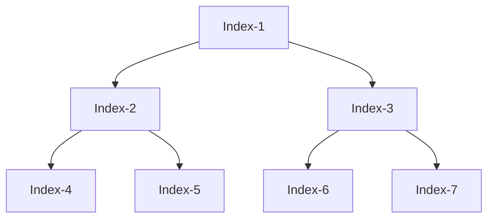

# Merkle Branch Engineering Optimization

Given that we're doing lots of queries from the same Merkle Tree, these queries are expected to have quite a bit of overlap close to the root. To minimize computation, rather than checking all the way to the root, we choose a cut-off point called `top_layer`.

## Storing the Top of the Tree
We store that entire layer, and for each query, we check our Merkle branches from leaf to `top_layer`. The paths from `top_layer` to the Merkle root only need to be checked once.

More concretely, we initialize a vector `top` that will hold the top of the Merkle Tree. We initialize a vector `top` of size 2*`top_size`. We populate the second half of this vector with digests from `iop.read_digests`.

Then, for `i` in `(1..top_size)`, in reverse order, we compute `top[i] = hash(top[2*i], top[2*i +1])`. We end with the top of the Merkle tree stored in `top`, with the `top[0]` untouched and the Merkle Root in `top[1]`.

## Checking the Branches
Now, with a branch that passes through `Index-4`, this optimization allows us to check the root matches Index-1 and that the branch from leaf to `Index-4` is valid.
