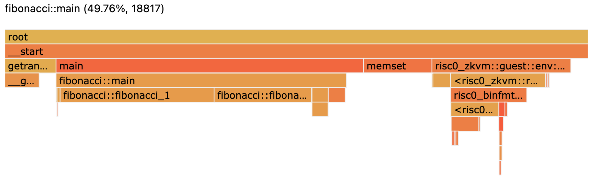

# Profiling Guest Code

In this example we demonstrate how to profile on the RISC Zero zkVM guest programs, using the Fibonacci sequence calculation as an example.

<!-- NOTE: This content matches the docs under website/api/zkvm/developer-guide/profiling.md -->

## Background

Profiling tools, like [pprof] and [perf], allow collecting performance information over the entire execution of your program, and help create visualizations for the performance of your program.
RISC Zero has experimental support for generating pprof files for cycle counts.

[Sampling CPU profilers], as implemented by pprof and perf, provide a view of where your program is spending its time.
It does so by recording the current call stack at a sampling interval.
RISC Zero provides a "sampling" [^1] CPU profiler for guest execution.

## Usage

### Step 1: Prerequisites

First, follow the [examples guide] to install dependencies and check out the correct version of the example.

Additionally, you will need to [install Go], which bundles with it the [pprof] tool.

### Step 2: Running

Run the Fibonacci profiling example with:

```bash
RISC0_PPROF_OUT=./profile.pb cargo run
```

The above command will run the Fibonacci computation for 1000 iterations and write the profiling output to `profile.pb`.
Use the environment variable `RISC0_PPROF_OUT` to set the desired output path for the profiling data.

### Step 3: Visualization

To visualize the profile using `pprof`, run:

```bash
go tool pprof -http=127.0.0.1:8000 profile.pb
```

Then navigate to [http://localhost:8000](http://localhost:8000) in your browser.

You can find much more information about how to use `pprof` in the [official pprof documentation].

## Exploring the Example Profile

There are three different Fibonacci sequence calculation methods provided in this example:

1. `fibonacci_1`: A basic iterative method.
2. `fibonacci_2`: An optimized iterative method that attempts to batch computation.
3. `fibonacci_3`: A matrix exponentiation approach, which is a fast method to compute Fibonacci numbers.

The guest code reads the number of iterations from the host, computes the Fibonacci number using all the above methods, and finally commits the answer back to the host.

Below is the example [flamegraph] you will see by opening [http://localhost:8000/ui/flamegraph](http://localhost:8000/ui/flamegraph), after running the [steps above](#usage).



When you visualize the profiling data, you can see the relative performance in terms of [cycle count] of the three Fibonacci implementations.
This can be helpful in understanding the efficiency of various algorithms and their performance implications.

Use the pprof web interface to compare the performance of the 3 Fibonacci implementations.
Refer to the [pprof docs] for more information about the web interface.

[^1]:
    Here "sampling" is in quotes because the profiler actually captures the call
    stack at every cycle of program execution. Capturing a call stack on every
    cycle of execution is not done in most programs on physical CPUs for a few
    reasons:
    <!-- HACK: This comment prevents the list below from being interpreted as a code block -->
    - It would be cost prohibitive to do so for all but quite short program
      executions.
    - Introducing such heavy profiling would actually alter the performance
      characteristics in significant ways.
    <!-- -->
    In zkVM execution, executions are generally short and all execution is
    synchronous and is not subject to any deviations in behavior due to
    measurement overhead.

[cycle count]: https://dev.risczero.com/terminology#clock-cycles
[examples guide]: https://dev.risczero.com/api/zkvm/examples/#running-the-examples
[flamegraph]: https://www.brendangregg.com/FlameGraphs/cpuflamegraphs.html
[install Go]: https://go.dev/doc/install
[official pprof documentation]: https://github.com/google/pprof/blob/main/doc/README.md
[perf]: https://perf.wiki.kernel.org/index.php/Main_Page
[pprof]: https://github.com/google/pprof
[pprof docs]: https://github.com/google/pprof/blob/main/doc/README.md#web-interface-1
[Sampling CPU profilers]: https://nikhilism.com/post/2018/sampling-profiler-internals-introduction/
