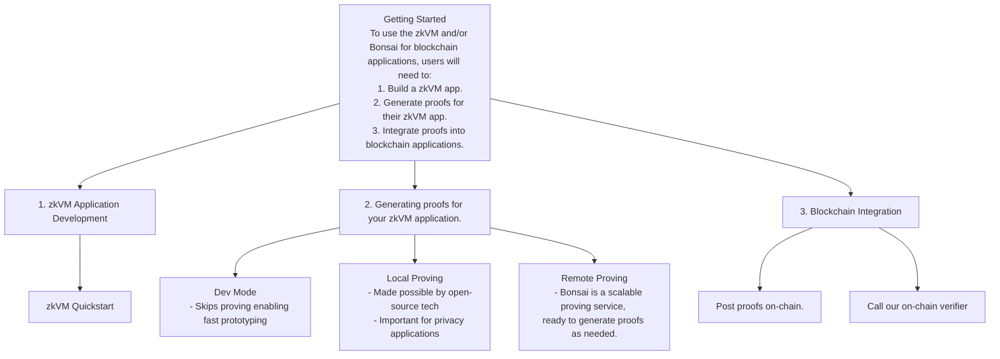

# Introduction

Welcome to the [RISC Zero] documentation!

RISC Zero is creating the infrastructure & tooling necessary for
developers around the globe to build software that leverages ZK technology.

ZK technology is staged to re-shape the way we interact digitally. Historically,
the only method for confirming the correct execution of a software application
was through redundant computation. ZK introduces a new option: **verifiable
computation**.

It's now possible to pair a program's output with a self-certifying _receipt_,
allowing a skeptical third party to verify correct execution — and the verifier
doesn't need to repeat the original computation or even see the inputs to the
program!

## Getting Started

To harness the power of ZK, you'll need to:

1. [Write an application for the RISC Zero zkVM][zkvm-quickstart].
2. [Generate proofs for your zkVM application][bonsai-quickstart].
3. [Integrate your proofs into on-chain applications][foundry-template].

[zkvm-quickstart]: ./zkvm/quickstart.md
[bonsai-quickstart]: ./bonsai/quickstart.md
[foundry-template]: https://github.com/risc0/bonsai-foundry-template
[RISC Zero]: https://risczero.com
