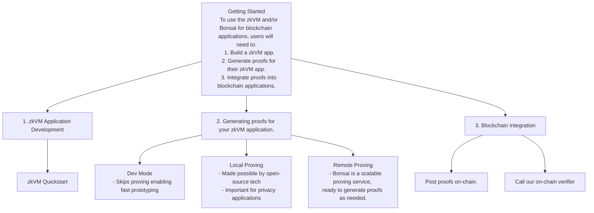

# Introduction

Welcome to the [RISC Zero] documentation!

RISC Zero is creating the infrastructure & tooling necessary for
developers around the globe to build software that leverages ZK technology.

ZK technology is staged to re-shape the way we interact digitally. Historically,
the only method for confirming the correct execution of a software application
was through redundant computation. ZK introduces a new option: **verifiable
computation**.

It's now possible to pair a program's output with a self-certifying _receipt_,
allowing a skeptical third party to verify correct execution — and the verifier
doesn't need to repeat the original computation or even see the inputs to the
program!

## Getting Started

To harness the power of ZK, you'll need to:

1. [Write an application for the RISC Zero zkVM][zkvm-quickstart].
2. [Generate proofs for your zkVM application][bonsai-quickstart].
3. [Integrate your proofs into on-chain applications][foundry-template].

[zkvm-quickstart]: ./zkvm/quickstart.md
[bonsai-quickstart]: ./generating-proofs/remote-proving.md
[foundry-template]: https://github.com/risc0/bonsai-foundry-template
[Bonsai]: ./generating-proofs/remote-proving.md
[chess]: https://github.com/risc0/risc0/tree/main/examples/chess
[continuations]: https://risczero.com/news/continuations
[crate-validation]: https://risc0.github.io/ghpages/dev/crate-validation/index.html
[discord]: https://discord.gg/risczero
[ecdsa]: https://github.com/risc0/risc0/tree/main/examples/ecdsa
[JSON]: https://github.com/risc0/risc0/tree/main/examples/json
[mailing-list]: https://fmree464va4.typeform.com/to/X3KJB85v
[optimism]: https://www.theblock.co/post/240929/optimism-zk-proof-proposals?utm_source=twitter&utm_medium=social
[performance]: ./zkvm/benchmarks.md
[proof-system]: /proof-system
[RISC Zero]: https://risczero.com
[risc0-repo]: https://github.com/risc0/risc0
[risc0-zkvm]: https://docs.rs/risc0-zkvm
[rust-libraries]: https://github.com/risc0/risc0#rust-libraries
[startup]: https://risczero.com/news/series-a
[twitter]: https://twitter.com/risczero
[waldo]: https://risczero.com/news/waldo
[YouTube]: https://www.youtube.com/@risczero
[zk coprocessors]: https://twitter.com/RiscZero/status/1677316664772132864
[zkpoex]: https://risczero.com/news/zkpoex
[zkVM]: ./zkvm/zkvm_overview.md
