# Recursive Proving

RISC Zero's zkVM uses recursive proving in order to achieve unbounded computation size, constant proof size, proof aggregation, and proof composition.

The end-to-end process for proof generation is shown in the following diagram, including links to the associated crate docs:

```mermaid
flowchart LR

execute("<a href='https://docs.rs/risc0-zkvm/latest/risc0_zkvm/struct.ApiClient.html#method.execute'>.execute()</a>")
--> Session

subgraph Session["<a href='https://docs.rs/risc0-zkvm/latest/risc0_zkvm/struct.Session.html'>Session</a>"]
direction TB
s1("<a href='https://docs.rs/risc0-zkvm/latest/risc0_zkvm/struct.Segment.html'>Segment</a>")
s2("<a href='https://docs.rs/risc0-zkvm/latest/risc0_zkvm/struct.Segment.html'>Segment</a>")
s3("<a href='https://docs.rs/risc0-zkvm/latest/risc0_zkvm/struct.Segment.html'>Segment</a>")
s4("<a href='https://docs.rs/risc0-zkvm/latest/risc0_zkvm/struct.Segment.html'>Segment</a>")
s5("<a href='https://docs.rs/risc0-zkvm/latest/risc0_zkvm/struct.Segment.html'>Segment</a>")
s6("<a href='https://docs.rs/risc0-zkvm/latest/risc0_zkvm/struct.Segment.html'>Segment</a>")
end

  s1-->ps1("<a href='https://docs.rs/risc0-zkvm/latest/risc0_zkvm/struct.ApiClient.html#method.prove_segment'>.prove_segment()</a>")
  s2-->ps2("<a href='https://docs.rs/risc0-zkvm/latest/risc0_zkvm/struct.ApiClient.html#method.prove_segment''>.prove_segment()</a>")
  s3-->ps3("<a href='https://docs.rs/risc0-zkvm/latest/risc0_zkvm/struct.ApiClient.html#method.prove_segment''>.prove_segment()</a>")
  s4-->ps4("<a href='https://docs.rs/risc0-zkvm/latest/risc0_zkvm/struct.ApiClient.html#method.prove_segment''>.prove_segment()</a>")
  s5-->ps5("<a href='https://docs.rs/risc0-zkvm/latest/risc0_zkvm/struct.ApiClient.html#method.prove_segment''>.prove_segment()</a>")
  s6-->ps6("<a href='https://docs.rs/risc0-zkvm/latest/risc0_zkvm/struct.ApiClient.html#method.prove_segment''>.prove_segment()</a>")

subgraph CompositeReceipt["<a href='https://docs.rs/risc0-zkvm/latest/risc0_zkvm/struct.CompositeReceipt.html'>CompositeReceipt</a>"]
direction TB
c1("<a href='https://docs.rs/risc0-zkvm/latest/risc0_zkvm/struct.SegmentReceipt.html'>SegmentReceipt</a>")
c2("<a href='https://docs.rs/risc0-zkvm/latest/risc0_zkvm/struct.SegmentReceipt.html'>SegmentReceipt</a>")
c3("<a href='https://docs.rs/risc0-zkvm/latest/risc0_zkvm/struct.SegmentReceipt.html'>SegmentReceipt</a>")
c4("<a href='https://docs.rs/risc0-zkvm/latest/risc0_zkvm/struct.SegmentReceipt.html'>SegmentReceipt</a>")
c5("<a href='https://docs.rs/risc0-zkvm/latest/risc0_zkvm/struct.SegmentReceipt.html'>SegmentReceipt</a>")
c6("<a href='https://docs.rs/risc0-zkvm/latest/risc0_zkvm/struct.SegmentReceipt.html'>SegmentReceipt</a>")
end

ps1-->c1
ps2-->c2
ps3-->c3
ps4-->c4
ps5-->c5
ps6-->c6


c1-->l1("<a href='https://docs.rs/risc0-zkvm/latest/risc0_zkvm/struct.ApiClient.html#method.lift'>.lift()</a>")
c2-->l2("<a href='https://docs.rs/risc0-zkvm/latest/risc0_zkvm/struct.ApiClient.html#method.lift'>.lift()</a>")
c3-->l3("<a href='https://docs.rs/risc0-zkvm/latest/risc0_zkvm/struct.ApiClient.html#method.lift'>.lift()</a>")
c4-->l4("<a href='https://docs.rs/risc0-zkvm/latest/risc0_zkvm/struct.ApiClient.html#method.lift'>.lift()</a>")
c5-->l5("<a href='https://docs.rs/risc0-zkvm/latest/risc0_zkvm/struct.ApiClient.html#method.lift'>.lift()</a>")
c6-->l6("<a href='https://docs.rs/risc0-zkvm/latest/risc0_zkvm/struct.ApiClient.html#method.lift'>.lift()</a>")

l1-->suc1("<a href='https://docs.rs/risc0-zkvm/latest/risc0_zkvm/struct.SuccinctReceipt.html'>SuccinctReceipt</a>")
l2-->suc2("<a href='https://docs.rs/risc0-zkvm/latest/risc0_zkvm/struct.SuccinctReceipt.html'>SuccinctReceipt</a>")
l3-->suc3("<a href='https://docs.rs/risc0-zkvm/latest/risc0_zkvm/struct.SuccinctReceipt.html'>SuccinctReceipt</a>")
l4-->suc4("<a href='https://docs.rs/risc0-zkvm/latest/risc0_zkvm/struct.SuccinctReceipt.html'>SuccinctReceipt</a>")
l5-->suc5("<a href='https://docs.rs/risc0-zkvm/latest/risc0_zkvm/struct.SuccinctReceipt.html'>SuccinctReceipt</a>")
l6-->suc6("<a href='https://docs.rs/risc0-zkvm/latest/risc0_zkvm/struct.SuccinctReceipt.html'>SuccinctReceipt</a>")


suc1-->j1("<a href='https://docs.rs/risc0-zkvm/latest/risc0_zkvm/struct.ApiClient.html#method.join'>.join()</a>")
suc2-->j1
suc3-->j2("<a href='https://docs.rs/risc0-zkvm/latest/risc0_zkvm/struct.ApiClient.html#method.join'>.join()</a>")
suc4-->j2
suc5-->j3("<a href='https://docs.rs/risc0-zkvm/latest/risc0_zkvm/struct.ApiClient.html#method.join'>.join()</a>")
suc6-->j3

j1-->suc11("<a href='https://docs.rs/risc0-zkvm/latest/risc0_zkvm/struct.SuccinctReceipt.html'>SuccinctReceipt</a>")
j2-->suc12("<a href='https://docs.rs/risc0-zkvm/latest/risc0_zkvm/struct.SuccinctReceipt.html'>SuccinctReceipt</a>")
j3-->suc13("<a href='https://docs.rs/risc0-zkvm/latest/risc0_zkvm/struct.SuccinctReceipt.html'>SuccinctReceipt</a>")

suc11-->j11("<a href='https://docs.rs/risc0-zkvm/latest/risc0_zkvm/struct.ApiClient.html#method.join'>.join()</a>")
suc12-->j11

j11-->suc21("<a href='https://docs.rs/risc0-zkvm/latest/risc0_zkvm/struct.SuccinctReceipt.html'>SuccinctReceipt</a>")

suc21-->j21("<a href='https://docs.rs/risc0-zkvm/latest/risc0_zkvm/struct.ApiClient.html#method.join'>.join()</a>")
suc13-->j21

j21-->suc31("<a href='https://docs.rs/risc0-zkvm/latest/risc0_zkvm/struct.SuccinctReceipt.html'>SuccinctReceipt</a>")

suc31-->id("<a href='https://docs.rs/risc0-zkvm/latest/risc0_zkvm/struct.ApiClient.html#method.identity_p254'>.identity_p254()</a>")

id-->suc41("<a href='https://docs.rs/risc0-zkvm/latest/risc0_zkvm/struct.SuccinctReceipt.html'>SuccinctReceipt</a>")

suc41-->compress("<a href='https://docs.rs/risc0-zkvm/latest/risc0_zkvm/struct.ApiClient.html#method.compress'>.compress()</a>")

compress-->groth16("<a href='https://docs.rs/risc0-zkvm/latest/risc0_zkvm/struct.Groth16Receipt.html'>Groth16Receipt</a>")
```

To summarize the diagram:
1. The program is `executed`, resulting in a collection of `Segments`.
1. Each `Segment` is proven, resulting in a `SegmentReceipt`.
1. Each `SegmentReceipt` is `lift`ed, resulting in a `SuccinctReceipt`.
1. Pairs of `SuccinctReceipts` are `join`ed, resulting in another `SuccinctReceipt`. This continues until a single `SuccinctReceipt` remains.
1. The final `SuccinctReceipt` is passed through `identity_p254`, which prepares for Groth16 proving.
1. The `SuccinctReceipt` is `compress`ed, generating a `Groth16Receipt`.

The `Groth16Receipt` can now be posted on-chain and verified by the [RISC Zero Verifier Contract].

## Recursive Circuit Architecture

RISC Zero's zkVM consists of three circuits.

1. The RISC-V Circuit is a STARK circuit that proves correct execution of RISC-V programs.
1. The Recursion Circuit is a separate STARK circuit, that's designed to efficiently generate proofs for the verification of STARK proofs and to support the integration of custom accelerator circuits into the zkVM.
This circuit has a similar architecture to the RISC-V Circuit, but with fewer columns and a much simpler instruction set.
The Recursion Circuit supports a number of programs, including [lift], [join], [resolve], and [identity_p254].
The same [proof system] is used for both the RISC-V Circuit and the Recursion Circuit.
1. The STARK-to-SNARK Circuit is an R1CS circuit that proves verification of proofs from the `identity_p254` program.

*The size of a [Receipt] varies depending on the size of the ReceiptClaim and its ReceiptKind, but the size of the `seal` is constant on SuccinctReceipts and on Groth16 Receipts.
