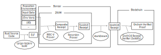

# Security Model

RISC Zero is proud to offer an end-to-end solution for verifiable computation.
Users can generate proofs for correct execution of Rust code using the [RISC Zero zkVM],
and they can verify those proofs on-chain using our permissionless [verifier contract] on Ethereum networks such as Sepolia.

The rest of this document offers an overview of the security model for applications that rely on RISC Zero's tooling.

RISC Zero offers the following components, each of which is ready for use on testnet.

## Overview of Components

1. The **cargo risczero** tool, which compiles user-written Rust code into RISC-V ELF binaries [deterministically].

2. The **RISC-V Prover**, which executes and proves ELF binaries produced by the `cargo risczero` tool.

3. The **Recursion Prover**, which is used to aggregate proofs from the RISC-V Prover.
   The recursion prover supports a small number of programs, including [lift], [join], and [resolve].
   Each recursion program is identified by a [control ID], and the full list of allowed programs is identified by the [control root].

4. The **STARK-to-SNARK Prover**, which verifies proofs from the RISC Zero Recursion Prover, compressing the STARK into a Groth16 SNARK.
   The [control root] is passed to as an input, allowing for updates to our RISC-V Prover without requiring a new trusted setup ceremony.

5. The **on-chain verifier contract**, which verifies proofs from the RISC Zero STARK-to-SNARK Prover.
   Version information for the on-chain verifier is available in our [verifier contract] documentation.

Together, these components allow developers to integrate proofs of arbitrary Rust code into their on-chain applications.
In order to use these components, developers provide:

- the Rust code for their zkVM guest program.
- a smart contract on-chain whose behavior will depend on the output of the Verifier Contract

**We strongly recommend third-party audits of each of these two components before deploying your application to production.**

## Zero-Knowledge Proving

Proofs generated by the Recursion Prover and proofs generated by the STARK-to-SNARK Prover reveal no information beyond the contents of the [receipt claim].
Even with unlimited computing power, no secrets can be extracted from proofs posted on-chain.

:::warning

Whoever is generating the proofs can see the secret data. Users may choose to use any of these provers locally to ensure their data stays private.

:::

:::warning

Proofs generated by the **RISC-V Prover** that haven't been passed through the **Recursion Prover** leak information about the length of execution.
Passing proofs through the Recursion Prover resolves this warning: recursion proofs leak no information about execution length.

:::

# Cryptographic Security

In analyzing the cryptographic security of our system, we consider two primary questions:

1. Can a malicious user who doesn't know a valid [execution trace] for the given [receipt claim] create a fake proof that will trick the verifier?
2. Can a malicious user extract secret information from a proof posted on-chain?

The first question is about the **soundness** of the protocol, and the second question is whether the protocol is **zero-knowledge**.

Soundness is often quantified in terms of “[bits]” — our system currently targets 98 bits of security.

| Prover                | Cryptographic Assumptions                                                                 | Bits of Security | Quantum Safe? |
| --------------------- | ----------------------------------------------------------------------------------------- | ---------------- | ------------- |
| RISC-V Prover         | - Random Oracle Model   - Toy Problem Conjecture                                      | 98               | Yes           |
| Recursion Prover      | - Random Oracle Model   - Toy Problem Conjecture                                      | 99               | Yes           |
| STARK-to-SNARK Prover | - Security of elliptic curve pairing over BN254.   - Knowledge of Exponent assumption | 99+              | No            |

The Toy Problem conjecture, specified in detail in the [ethSTARK documentation], says that the best known attack on STARK proof systems is the best possible attack.

## The STARK Provers

The RISC-V Prover and the Recursion Prover both use STARK-based protocols, which are not known to be vulnerable to attacks via quantum computers.

### How secure are the STARK Provers?

We estimate that it would cost over 400 billion USD of computational resources to construct a fake proof for one of our STARK Provers.

These estimates are based on the approach used in [this article by Justin Thaler].
The napkin math here is as follows:

- Thaler estimated \$1.6 million to launch a viable attack against an 80 bit STARK system.
- 98 bits is $2^{18}$ times more secure than 80 bits.

The analysis for bits of security for the RISC-V and Recursion Prover can be found in the [security calculator].
For a detailed cryptographic description of our STARK system, we refer readers to [RISC Zero zkVM: Scalable, Transparent Arguments of RISC-V Integrity].

## The STARK to SNARK Translator

The STARK to SNARK translator uses a Groth16 prover over the BN254 pairing-friendly curve. The security of this part of the protocol depends on elliptic curve cryptography, and is therefore vulnerable to attacks from quantum computers.

### How secure is the STARK to SNARK Prover?

The best known attack vector against our STARK to SNARK Prover is to attack the underlying elliptic curve pairing used with BN254.
This primitive has been heavily battle-tested: it's part of the core cryptography on Zcash and it's included as a precompile on Ethereum (see EIP-197).

For a detailed discussion of the security of BN254, we refer readers to the discussion on this [GitHub issue from Zcash].

[lift]: https://docs.rs/risc0-zkvm/0.21/risc0_zkvm/struct.ApiClient.html#method.lift
[join]: https://docs.rs/risc0-zkvm/0.21/risc0_zkvm/struct.ApiClient.html#method.join
[resolve]: https://docs.rs/risc0-zkvm/0.21/risc0_zkvm/struct.ApiClient.html#method.resolve
[control ID]: /terminology#control-id
[control root]: /terminology#control-root
[execution trace]: /terminology#execution-trace
[ethSTARK documentation]: https://eprint.iacr.org/2021/582
[deterministically]: /terminology#deterministic-builds
[GitHub issue from Zcash]: https://github.com/zcash/zcash/issues/714
[receipt claim]: /terminology#receipt-claim
[RISC Zero zkVM: Scalable, Transparent Arguments of RISC-V Integrity]: pathname:///proof-system-in-detail.pdf
[RISC Zero zkVM]: ./zkvm
[security calculator]: https://github.com/risc0/risc0/pull/1661
[this article by Justin Thaler]: https://a16zcrypto.com/posts/article/snark-security-and-performance/
[bits]: https://a16zcrypto.com/posts/article/snark-security-and-performance/
[Verifier Contract]: ./blockchain-integration/contracts/verifier.md
