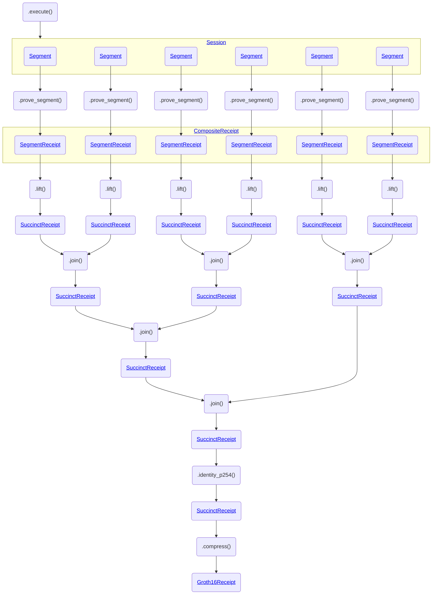

# Recursive Proving

RISC Zero's zkVM uses recursive proving in order to achieve unbounded computation size, constant proof size, proof aggregation, and proof composition.

:::tip
[`Prover::prove_with_opts`] allows users to choose between [composite, succinct or groth16 receipts].
:::

:::info
For benchmarks, check out [reports.risczero.com].
:::

The rest of this page describes low-level details that are not necessary for users.

## Recursive Proving Process

The end-to-end process for proof generation is shown in the following diagram.

To summarize the diagram:

1. The program is _executed_, resulting in a collection of _Segments_.
2. Each _Segment_ is proven, resulting in a _SegmentReceipt_.
3. Each _SegmentReceipt_ is _lifted_, resulting in a _SuccinctReceipt_.
4. Pairs of _SuccinctReceipts_ are _joined_, resulting in another _SuccinctReceipt_. This continues until a single _SuccinctReceipt_ remains.
5. The final _SuccinctReceipt_ is passed through _identity\_p254_, which prepares for Groth16 proving.
6. The _SuccinctReceipt_ is _compressed_, generating a _Groth16Receipt_.

The _Groth16Receipt_ can now be posted on-chain and verified by the [RISC Zero Verifier Contract].

## Recursive Circuit Architecture

RISC Zero's zkVM consists of three circuits.

1. The RISC-V Circuit is a STARK circuit that proves correct execution of RISC-V programs.
2. The Recursion Circuit is a separate STARK circuit, that's designed to efficiently generate proofs for the verification of STARK proofs and to support the integration of custom accelerator circuits into the zkVM.
   This circuit has a similar architecture to the RISC-V Circuit, but with fewer columns and an instruction set optimized for cryptography.
   The same [proof system] is used for both the RISC-V Circuit and the Recursion Circuit.
3. The STARK-to-SNARK Circuit is an R1CS circuit that verifies proofs from the Recursion Circuit.

## Recursion Programs

The Recursion Circuit supports a number of programs, including `lift`, `join`, `resolve`, and `identity_p254`.
These are using internally to the [Prover] implementations to produce [SuccinctReceipt] and [Groth16Receipt].

1. The `lift` program verifies a STARK proof from the RISC-V Prover, using the Recursion Prover. This recursion proof has a single constant-time verification procedure, with respect to the original segment length, and is then used as the input to all other recursion programs (e.g. `join`, `resolve`, and `identity_p254`).
2. The `join` program verifies two proofs from the Recursion Prover, using the Recursion Prover. By repeated application of `join`, any number of receipts for execution spans within the same session can be compressed into a single receipt for the entire session.
3. The `identity_p254` program verifies a proof from the Recursion Prover using the Recursion Prover with the Poseidon254 hash function. The `identity_p254` program is used as the last step in the prover pipeline before running the Groth16 prover.

## STARK-to-SNARK Wrapping

All of the recursion programs in the previous section output a [SuccinctReceipt], which is a STARK proof (\~200kB)

The final step in the recursion process is `compress()`, which outputs a [Groth16Receipt], which can be verified on-chain using the [RISC Zero Verifier Contract].

[`Prover::prove_with_opts`]: https://docs.rs/risc0-zkvm/1.0/risc0_zkvm/trait.Prover.html#method.prove_with_opts
[composite, succinct or groth16 receipts]: https://docs.rs/risc0-zkvm/1.0/risc0_zkvm/enum.ReceiptKind.html
[Groth16Receipt]: https://docs.rs/risc0-zkvm/1.0/risc0_zkvm/struct.Groth16Receipt.html
[proof system]: /proof-system/proof-system-sequence-diagram
[Prover]: https://docs.rs/risc0-zkvm/1.0/risc0_zkvm/trait.Prover.html#method.prove_with_opts
[reports.risczero.com]: https://reports.risczero.com
[RISC Zero Verifier Contract]: blockchain-integration/contracts/verifier.md
[SuccinctReceipt]: https://docs.rs/risc0-zkvm/1.0/risc0_zkvm/struct.SuccinctReceipt.html
