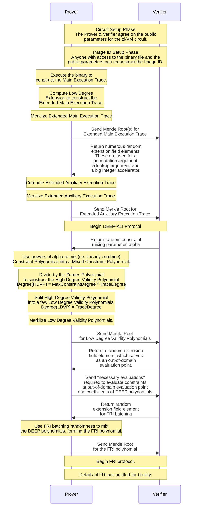

# The RISC Zero STARK Protocol

_The implementation in code for the RISC Zero STARK prover can be seen [here](https://github.com/risc0/risc0/blob/v0.18.0/risc0/zkp/src/prove/prover.rs).
In this document, we present an overview to the RISC Zero STARK protocol, as well as a sequence diagram and a detailed description below. The [STARK by Hand](stark-by-hand.md) explainer and the [RISC Zero ZKP Whitepaper][ZKP Whitepaper] are good companions to this document._

## Overview

RISC Zero's [receipts][Receipt] are built on the shoulders of several recent advances in the world of zero-knowledge cryptography.
The core of the proof system is [STARK]-based, implementing [DEEP-ALI & FRI].
This proof system is used to generate zero-knowledge validity proofs for RISC Zero's RISC-V circuit and RISC Zero's recursion circuit.
Users may also be interested in reading about the \[RISC Zero Groth16 Circuit], which enables on-chain verification.

At a high level, the design of the RISC Zero STARK protocol is very similar to the system described in [ethSTARK], and the system implemented in [Winterfell].

### Setup Phase

The protocol includes a two-part setup phase; the first setup happens once per zkVM version, and the second setup establishes the Image ID for a given RISC-V binary file.

#### Part 1: Circuit Setup

This setup is transparent and establishes the public parameters for the prover & verifier.
These public parameters include the number and length of the trace columns, the choice of hash function and Merklization structure, as well as a full enumeration of the constraints that are to be enforced.

#### Part 2: Program Setup

This phase establishes an [Image ID], which is determined transparently from a RISC-V binary file and the circuit parameters.
The [Image ID] is constructed by loading the RISC-V binary file into the zkVM memory, and then recording a Merkle snapshot of the full machine state.
This setup can be repeated by anyone with access to the binary file, in order to confirm the correctness of the [Image ID].

### Main Trace & Auxiliary Trace

After the setup phase, the Prover executes the binary in the zkVM, computes a Low-Degree Extension on each column, and commits the _Extended Main Execution Trace_.
Then, the prover computes and commits the _Extended Auxiliary Execution Trace_ which depends on verifier randomness.

Compared to [ethSTARK], our protocol adds an additional round of interaction to support constraints beyond basic AIR constraints.
Using constraints that may span both the main trace and the auxiliary trace, we proceed with [DEEP-ALI & FRI] as described in [ethSTARK].
Adding an Auxiliary Execution Trace enables various enhancements, relative to a Vanilla STARK protocol.
These enhancements are described well in [From AIRs to RAPs].

We use this Auxiliary Execution Trace to support:

1. A permutation argument for [memory verification](https://www.youtube.com/watch?v=dYuEPvRLwLo\&list=PLcPzhUaCxlCiLk_VjLUNbmfb2mB1Y_N9N\&index=5) 
   The permutation argument is currently implemented as a grand product accumulator argument, as in [PLONK](https://eprint.iacr.org/2019/953.pdf).
   We plan to change this to a [log derivative] accumulator argument in the next version of the circuit. 
   Here, operations corresponding to memory are committed to the main trace both in the original ordering and the permuted ordering, and grand product accumulators are committed in the auxiliary trace.
2. A lookup argument for range checks 
   The lookup argument is currently implemented using the approach described in [PLOOKUP].
   We plan to change this to a [log derivative] accumulator argument in the next version of the circuit.  
   Here, the tables and the witness are committed in the main trace, and grand product accumulators are committed in the auxiliary trace.
3. A big integer accelerator to enable [fast cryptographic operations][acceleration] 
   The bigint accelerator implements multiplication of `a` and `b` by asking the host to provide the product `c` as non-deterministic advice. Then, the verifier provides randomness `r`, and the constraints enforce that when `a`, `b`, and `c` are interpreted as polynomials, `a(r) * b(r) == c(r)`.  
   Here, `a`, `b`, and `c` are committed in the main trace, and the evaluations at `r` are committed in the auxiliary trace.

### DEEP-ALI & FRI

The rest of the protocol implements with [DEEP-ALI & FRI] as described in [EthSTARK].
We describe this in more detail below, and refer readers to the [ZKP Whitepaper] for a more formal description of the protocol.

## Sequence Diagram

## Detailed Step-by-Step Description

In this section, we elaborate on the sequence diagram above.
For a more formal articulation of the protocol, refer to the [ZKP Whitepaper].

### Extended Main Execution Trace

- The Prover runs a computation in order to generate an [`Execution Trace`](./what-is-a-trace.md).
  - The `trace` is organized into `columns`, and the columns are categorized as `control columns`, `data columns`, and `auxiliary/accum columns`.
    - The `control columns` handle system initialization and shutdown, the initial program code to load into memory before execution, and other control signals that don't depend on the program execution.
    - The `data columns` contain the input and the computation data, both of which are private. These columns are committed in two orderings:
      - in order of program execution, and
      - re-ordered by register first and clock cycle second. The re-ordered columns allow for efficient validation of RISC-V memory operations.
    - The `auxiliary/accum columns` are used for a permutation argument, a lookup argument, and a big integer accelerator circuit.
  - After computing the `data columns` and `auxiliary/accum columns,` the Prover adds some random `noise` to the end of those columns in order to ensure that the protocol is zero-knowledge.
- The Prover encodes the `trace` as follows:
  - The Prover converts each `column` into a polynomial using an `iNTT`. We'll refer to these as `Trace Polynomials`, denoted $P_i(x)$.
  - The Prover evaluates the `data polynomials` and the `control polynomials` over an expanded domain. The evaluations of the `data polynomials` and the `control polynomials` over this larger domain is called the `Extended Main Execution Trace`.
  - The Prover commits the `Extended Main Execution Trace` into two separate Merkle Trees, sending the roots to the Verifier.

### Extended Auxiliary Execution Trace

- Using the transcript-thus-far as an entropy-source, we choose some random extension field elements, using a SHA-2 CRNG.
- Then, the Prover uses the randomness to generate the `auxiliary/accum columns`. The Prover computes the Low-Degree Extension of the auxiliary columns to form the Extended Auxiliary Execution Trace.
- The Prover commits the Extended Auxiliary Execution Trace to a Merkle tree and sends the Merkle root to the Verifier.
- Using the transcript-thus-far as an entropy-source, we choose a random `constraint mixing parameter` $\alpha$, using a SHA-2 CRNG.

### DEEP-ALI (part 1)

- The Prover uses the `constraint mixing parameter`, the `Trace Polynomials`, and the `Rule Checking Polynomials` to construct a few `Low Degree Validity Polynomials.` The details are as follows:
  - By writing $k$ publicly known `Rule Checking Polynomials`, $R_0, R_1, ..., R_{k-1}$, in terms of the private `Trace Polynomials`, the Prover generates $k$ `Constraint Polynomials`, $C_j(x)$.
    - The key point about these polynomials is that for each of the $k$ rules and each input $z$ that's associated with the trace, $C_j(z)$ will return 0 if the trace "passes the test," so to speak.
  - Using the `constraint mixing parameter` $\alpha$, the Prover combines the `Constraint Polynomials`, $C_j$ into a single `Mixed Constraint Polynomial`, $C$, by computing $C(x)=\alpha^0C_0(x)+\ldots+\alpha^{k-1}C_{k-1}(x).$
    - Note that if each $C_j$ returns 0 at some point $z$, then $C$ will also return 0 at $z$.
  - Using a publicly known `Zeros Polynomial`, the Prover computes the `High Degree Validity Polynomial`, $V(x)=\frac{C(x)}{Z(x)}$.
    - The `Zeros Polynomial` $Z(x)$ is a divisor of any honest construction of $C(x)$.
      In other words, an honest prover will construct $V(x)$ to be a polynomial of lower degree than $C(x)$.
      We call $V$ "high degree" relative to the Trace Polynomials, $P_i$.
  - The Prover `splits` the `High Degree Validity Polynomial` into 4 `Low Degree Validity Polynomials`, $v_0(x), v_1(x), ..., v_3$.
  - The Prover evaluates the `Low Degree Validity Polynomials`, encodes them in a Merkle Tree, and sends the Merkle root to the Verifier.
  - We use Fiat-Shamir to choose an out-of-domain evaluation point, $z$.

### DEEP-ALI (part 2)

- The Verifier would like to check the asserted relation between $C$, $Z$, and $V$ at the `DEEP Test Point,` $z$.
  Namely, the Verifier would like to confirm that $V(z)Z(z)=C(z)$.
  - The Prover sends the evaluations of each $v_i$ at $z$, which allows the Verifier to compute $V(z)$.
  - Computing $C(z)$ is slightly more complicated. Because `rule checks` can check relationships across multiple `columns` and multiple `clock cycles`, evaluating $C(z)$ requires numerous evaluations of the form $P_i(\omega^nz)$ for varying `columns` $i$ and `cycles` $n$.
    The Prover sends these `necessary evaluations` of each $P_i$ to allow the Verifier to evaluate $C(z)$.
    We refer to the `necessary evaluations` $P_i(\omega^nz)$ as the `taps` of $P_i$ at $z$.
  - The Verifier can now check $V(z)Z(z)=C(z)$.
  - Although these asserted evaluations have no associated Merkle branches, the DEEP technique offers an alternative to the usual Merkle proof.
- The Prover constructs the DEEP polynomials using the `taps`:
  - Denoting the `taps` of $P_i$ at $z$ as $(x_1,P_i(x_1)),\ldots,(x_n,P_i(x_n))$, the Prover constructs the DEEP polynomial $P'_i(x)=\frac{P_i(x)-\overline{P_i}(x)}{(x-x_1)\ldots(x-x_n)}$ where $\overline{P_i}(x)$ is the polynomial formed by interpolating the taps of $P_i$. The Prover computes $P'_i$, runs an iNTT on the result, and sends the coefficients of $P'_i$ to the Verifier.
    Using this technique, the Prover constructs and sends a DEEP polynomial for each $P_i$ and each $v_i$.
- At this point, the claim of trace validity has been reduced to the claim that each of the DEEP polynomials is actually a low-degree polynomial.
  To conclude the proof, the Prover mixes the DEEP polynomials into the `FRI Polynomial` using a `DEEP mixing parameter` and use the FRI protocol to show that the `FRI Polynomial` is a low-degree polynomial.

### The FRI Protocol

- We omit the details of the [DEEP-ALI & FRI] for brevity.

Thanks for reading! If you have questions or feedback, we'd love to hear from you on Discord or Twitter.

[acceleration]: /api/zkvm/acceleration
[DEEP-ALI & FRI]: ../reference-docs/about-fri.md
[ethSTARK]: https://eprint.iacr.org/2021/582.pdf
[From AIRs to RAPs]: https://hackmd.io/FLbS_DLxRpmcWHCBQx76Cw
[Image ID]: /terminology#image-id
[log derivative]: https://eprint.iacr.org/2022/1530.pdf
[PLOOKUP]: https://eprint.iacr.org/2020/315.pdf
[Receipt]: https://docs.rs/risc0-zkvm/*/risc0_zkvm/struct.Receipt.html
[STARK]: ../reference-docs/about-starks.md
[Winterfell]: https://github.com/facebook/winterfell
[ZKP Whitepaper]: https://dev.risczero.com/proof-system-in-detail.pdf
