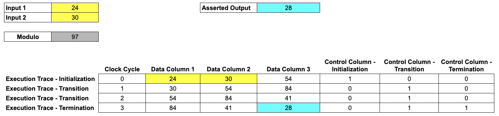
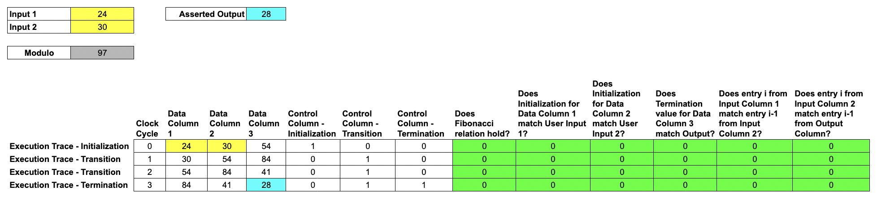
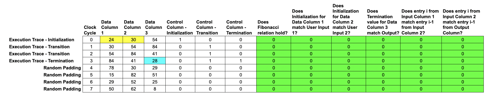
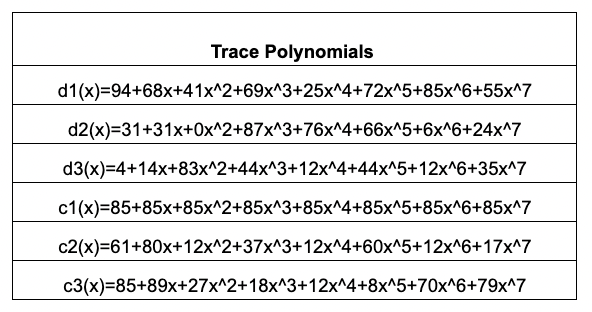
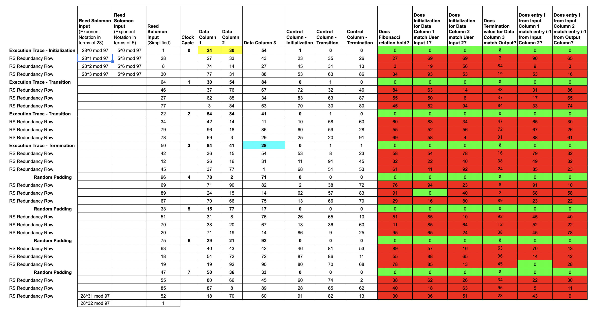
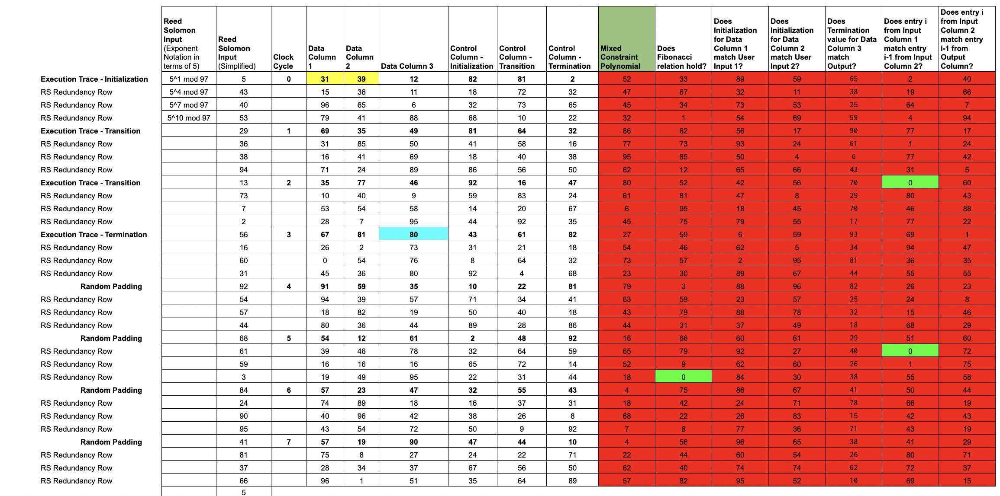
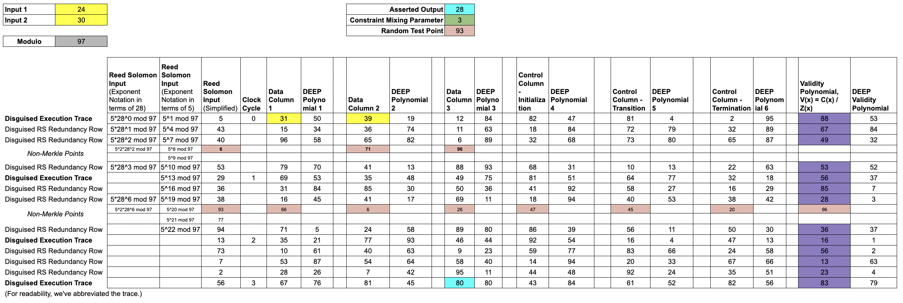

# STARK by Hand

> When the RISC Zero [zkVM](/api/zkvm) executes, it generates a [receipt](https://docs.rs/risc0-zkvm/*/risc0_zkvm/struct.Receipt.html) that allows third-parties to authenticate the validity of the execution.
> The receipt contains a [zk-STARK](../reference-docs/about-starks.md) in the form of the [seal](https://docs.rs/risc0-zkvm/*/risc0_zkvm/struct.SegmentReceipt.html#structfield.seal).
> The zk-STARK that lives on the receipt is the crux of RISC Zero's technology.

The construction of the RISC Zero STARK is highly technical, relying on several recent advances in the world of zero-knowledge cryptography.
Specifically, constructing RISC Zero's zk-STARK uses the DEEP-ALI protocol & the batched FRI protocol (after a randomized preprocessing step).

In this series of 12 brief lessons, we walk through a simplified numerical example of the construction of RISC Zero's STARK.

- [Google Sheet version](https://docs.google.com/spreadsheets/d/1Onr41OozD62y-B0jIL7bHAH5kf771-o4xvmnHUFpOyo/edit?usp=sharing)
- [PDF Version](https://dev.risczero.com/STARK-by-hand.pdf)
- [Python Version](https://dev.risczero.com/didactic_stark.py)

If you make sense of these 12 lessons, you'll have a solid handle on the mechanics of a zk-STARK (and we'd likely love to [hire you](https://jobs.ashbyhq.com/RiscZero)).

The [proof system sequence diagram](proof-system-sequence-diagram.md) describes this process in more generality; we suggest going back and forth between this document and the sequence diagram.

## Lesson 1: The Execution Trace

> When any code executes in the RISC Zero virtual machine, each step of that execution is recorded in an [`Execution Trace`](./what-is-a-trace.md).

We show a simplified example, computing 4 steps of a Fibonacci sequence modulo 97, using two user-specified inputs.

In this example, our trace consists of 6 `columns`.

- Each of the first three columns is a record of the internal state of a register at each clock cycle from initialization until termination. We call these `Data Columns`.
- The next three columns are `Control Columns`, which we use to mark initialization and termination points.

> In the full RISC Zero protocol, the `Data Columns` hold the state of the [RISC-V] processor, including ISA registers, the program counter, and various microarchitecture details such as instruction decoding data, ALU registers, etc., while the `Control Columns` handle system initialization and shutdown, setting up the page table with the program memory image, and other control signals that don't depend on the programs execution.
>
> The full implementation also has `Accumulator Columns`, allowing for [RISC-V] memory emulation. The `Accumulator Columns` are not necessary in this simplified example.

## Lesson 2: Rule checks to validate a computation

Here, we introduce a number of rule-checking cells in order to demonstrate the validity of the execution.
In this example, we show six rules specific to generating Fibonacci numbers.

Each rule check is written as the polynomial over the data columns, for example $a + b - c$ which only equals $0$ when $a + b = c$.
In our example $a$, $b$, and $c$ may be terms in the data columns enforcing the Fibonacci sequence rule, that $F(i) + F(i+1) = F(i + 2)$.

Each rule is combined with a selector from the control columns to decide when to apply the rules.
For example, we should check that the output of one step is equal to the input to the next, except when we consider the first row where there is no prior step and instead it must be equal to the user input.
This combination is via multiplication e.g. $(s)(a + b - c)$ ensures that _either_ $a + b = c$ or $s = 0$.

Each rule checking column can be expressed as a multi-input, single-output polynomial, where the inputs are some combination of entries in the trace; we call these `rule-checking polynomials`.
All of these polynomials are over a finite field, in this example it is the integers modulo 97.

In the full [RISC-V] implementation, the rules make up what it means to execute [RISC-V] instructions properly (i.e. checking that the program counter increments after every instruction).
We check thousands of rules in order to validate the execution trace.

## Lesson 3: Padding the Trace

> Before encoding each column as a polynomial, we append random padding to the end of the Execution Trace, which adds the entropy needed to hide the user's data, allowing for a zero-knowledge protocol.

This random noise is generated by the host system's cryptographically secure pseudorandom number generator.
We set the Control columns to 0 for these random noise rows, in order to turn off our rule checks.

## Lesson 4: Constructing Trace Polynomials

> This lesson explains the mechanics of [Reed-Solomon encoding](../reference-docs/about-rs-codes.md).
> RS encoding is a form of error-correcting code; it allows for efficient addition of redundancy to cryptographic messages.

Let's remove the `rule-checking columns` for a minute and turn our attention toward encoding our Trace data in terms of polynomials.
Throughout these lessons, all of the arithmetic takes place in $\mathbb{F}_{97}$.

_From here on, the lessons assume some familiarity with finite fields. If finite fields are foreign to you, fear not!
This [finite fields primer](../reference-docs/about-finite-fields.md) covers just enough to make sense of RISC Zero's use of finite fields._

Every element of $\mathbb{F}_{97}$ can be written as a power of 5. In other words, the elements of $\mathbb{F}_{97}$ are $0, 5^0, 5^1, \ldots,$ and $5^{95}$.
We write $\mathcal{D}(5^{12})$ for the set of powers of $5^{12}$ and $\mathcal{D}(5^{3})$ for the set of powers of $5^{3}$.
Each of these sets is "evenly spaced" throughout $\mathbb{F}_{97}$, which facilitates the use of [number theoretic transforms](../reference-docs/about-ntts-and-fourier.md).

> Put succinctly, running an iNTT on a `trace column` gives the coefficients of a `trace polynomial`.

The table above shows the python code and associated input/output arrays; the input arrays correspond to the `trace columns` and the output arrays are the coefficients of the `trace polynomials`.
The key features about the `trace polynomials` are that:

- they are at most degree $7$ (length of the column minus $1$) and
- the `trace polynomial` evaluations on $\mathcal{D}(5^{12})$ precisely match the data in the padded execution trace.

> Evaluating the `trace polynomial` on the larger set $\mathcal{D}(5^{3})$ gives a Reed-Solomon encoded `trace block`.

We say the `block` is a `degree 4 expansion` of the `column`, and that the Reed-Solomon encoding has `rate` $\frac{1}{4}$. [Reed-Solomon encoding](../reference-docs/about-rs-codes.md) improves the soundness of the protocol by amplifying any errors in an invalid trace.

## Lesson 5: ZK Commitments of the Trace Data

> The next step is for the Prover to commit the `trace polynomials` into a Merkle tree.
> In order to make RS expansion play well with zero-knowledge, we have to avoid overlapping evaluation domains between the "trace domain" and the "commitment domain."

The Prover evaluates each `trace polynomial` over a `shift` of $\mathcal{D}(5^3)$.

We'll choose a shift of 5 and evaluate each `trace polynomial` over $x=5, 5^4, 5^7, ..., 5^{94}.$

Note that because of the `shift`, the yellow and blue cells in `Data Columns 1, 2, and 3` no longer match the `Inputs` and `Asserted Outputs`.
In fact, this shift in the evaluation domain `disguises` all the `Trace Data`.

> We only reveal information about the `disguised trace`, and the random padding we appended is sufficient to prevent an attacker from deducing any connection between the disguised trace and the actual trace.

## Lesson 6: Constraint Polynomials

> This lesson briefly describes how [arithmetization](https://medium.com/starkware/arithmetization-i-15c046390862) is accomplished in RISC Zero.
> The constraints are an "arithmetized" version of logical checks.

Now that we've encoded our `trace columns` into `trace polynomials`, let's return to our original Reed-Solomon domain and add back in our `rule-checking cells`.

Of course, we shouldn't expect these `rule checks` to evaluate to 0 in the `redundancy rows`, as they're not directly associated with the data from the `trace`.

> Conveniently, by writing these `rule checks` in terms of our `trace polynomials`, we can convert our multi-input rule checking polynomials into single-input polynomials, which we call `constraint polynomials`.

Note that each `constraint polynomial` will evaluate to 0 at the input values that are associated with actual trace data.

## Lesson 7: Mixing Constraint Polynomials

> We can reduce computational burden by compressing a bunch of constraints into one.
> To do so, we add one new column, which `mixes` our `constraint polynomials` into a single `mixed constraint polynomial`.

After the Prover commits a Merkle root for the `control polynomials` and the `data polynomials` (and the `accumulator polynomials` in the full implementation), those Merkle roots are used as entropy to randomly generate a `constraint mixing parameter` $\alpha_1$.

Letting $c_i$ denote the constraint polynomials, we write:

$C(x) = \alpha_1^0 * c_0(x) + \alpha_1^1 c_1(x) + ... + \alpha_1^5 c_5(x)$

Note that if each $c_i$ evaluates to 0 at some input $x$, then $C$ will also evaluate to 0 for that input.

In this example, the degree of the `mixed constraint polynomial` is equal to the degree of the `trace polynomials`, because the `rule-checking` involved is particularly simple.
In more complicated examples, composing our `rule checking polynomials` with our `trace polynomials` would yield `high degree constraint polynomials.`
In that case, we'd add an extra step at the end of Lesson 9 to split our `high degree validity polynomial` into a few `low degree validity polynomials`.

## Lesson 8: The Core of the RISC Zero STARK

> The Prover constructs the `validity polynomial` by dividing the `mixed constraint polynomial` from the previous lesson by the publicly known `zeros polynomial`.
>
> $V(x) = C(x) / Z(x)$

If we write the constraints in terms of the trace polynomials, the result will vanish at every root of the Zeros polynomial.
In our example, the `zeros polynomial` is

$Z(x) = (x-1)(x-47)(x-75)(x-33)(x-96)(x-50)(x-22)(x-64)$, where the 8 terms are the elements of $\mathcal{D}(5^{12})$.

> Normally, when we divide two low degree polynomials, we don't expect to get another low degree polynomial.
> But for an honest prover, it's not hard to see that V(x) will be lower degree than C(x), since the roots of Z(x) line up perfectly with roots of C(x).

The Prover evaluates V(x) over the $5, 5^4, \ldots, 5^{94}$, commits the values to a `validity Merkle tree`, and appends the root to the seal.

> The construction of these polynomials is the core conceptual thrust of RISC Zero's proof of trace validity.
> All of the information necessary to confirm the validity of the original Execution trace can be described in the following assertions about these polynomials:
>
> (i) V(x) = C(x) / Z(x) for all x
>
> (ii) The degree of the `validity polynomial` and each `trace polynomials` are less than or equal to 7.
>
> The [FRI protocol](../reference-docs/about-fri.md) is the technique we use for proving (ii). Those details are omitted from this simplified example.
>
> In the original STARK protocol, the Verifier tests (i) at a number of test points; the soundness of the protocol depends on the number of tests.
> The DEEP-ALI technique allows us to achieve a high degree of soundness with a single test.
> The details of DEEP are described in the following lesson.

## Lesson 9: The DEEP Technique

> The DEEP technique is a means of improving the security level associated with a single query by sampling from a larger domain than the commitment domain.
>
> Here, we use the `trace polynomials` and the `validity polynomial`(s) to construct the `DEEP polynomials`.
>
> The `DEEP polynomials` allow the Verifier to test $V(x) = C(x) / Z(x)$ outside the original Merkle tree commitments, which substantially improves the robustness of the Verifier's test.
>
> Without the DEEP technique, the Prover would assert that the trace polynomials $d_1, d_2, d_3, c_1, c_2, c_3,$ and the validity polynomial $V$ were all low degree polynomials.
> With the DEEP technique, the Prover argues instead that $d'_1, d'_2, d'_3, c'_1, c'_2, c'_3,$ and $V'$ are low degree polynomials.

With commitments of the `trace polynomials` and the `validity polynomial` in place, the Verifier uses the entropy of the seal to randomly choose a `DEEP test point`, $z$.
We use $z=93$ in this example.

The Verifier would like to be able to compute the `mixed constraint polynomial`, $C(93)$.
The Prover sends $V(93)$ and the `necessary evaluations` of the `trace polynomials` to allow the Verifier to compute $C(93)$.

In this example, the `necessary evaluations` are $d_1(93), d_2(93), d_3(93), c_1(93), c_2(93), c_3(93), d_2(93\cdot5^{-12}), d_3(93\cdot 5^{-12})$, shown in salmon.
Note that $5^{-12}$ is a pointer backwards 1 computational step; by pointing forward and backward, the `taps` allow for checking the rules that span multiple clock-cycles.

> These 8 points, together with the publicly known rule-checking functions, allow the Verifier to manually compute $C(93)$ and therefore $V(93)$.

The Prover also constructs the `DEEP polynomials`, interpolates each one, and sends the coefficients of each DEEP polynomial to the Verifier.
The `DEEP polynomials` are defined as follows:

$d'_1(x) = \frac{d_1(x) - d_1(93)}{x - 93}$
$d'_2(x) = \frac{d_2(x) - \overline{d_2}(x)}{(x-93)(x-6)}$ where $\overline{d_2}(x)$ is constructed by interpolating $(6, d_2(6))$ and $(93, d_2(93))$.

$d'_3(x) = \frac{d_3(x) - \overline{d_3}(x)}{(x-93)(x-6)}$ where $\overline{d_3}(x)$ is constructed by interpolating $(6, d_3(6))$ and $(93, d_3(93))$

$c'_1(x) = \frac{c_1(x) - c_1(93)}{x - 93}$

$c'_2(x) = \frac{c_2(x) - c_2(93)}{x - 93}$

$c'_3(x) = \frac{c_3(x) - c_3(93)}{x - 93}$

$V'(x)  = \frac{V(x) - V(93)}{x - 93}$ where the Prover computes V(93) by running `iNTT(ValidityColumn)` and then evaluating the resulting `validity polynomial` at $z=93$.

## Lesson 10: Mixing for FRI

> After using the `DEEP polynomials` to check the relation between the Trace Polynomial, the `validity polynomial`, and the `zeros polynomial` at $z=93$, the only thing left for the Prover to do is to show that the `DEEP polynomials` are low-degree.
>
> The [FRI protocol](../reference-docs/about-fri.md) provides a mechanism for the Verifier to confirm the low-degree-ness of polynomials, with very little computation required of the Verifier.
> In order to reduce this assertion of low-degree-ness to a single application of FRI, the Prover mixes the `DEEP polynomials` into a single FRI polynomial, using the DEEP Mixing parameter, $\alpha_2$.

Letting $c'_1, c'_2, c'_3, d'_1, d'_2, d'_3$, and $V'$ denote the `DEEP polynomials`, we mix the `DEEP polynomials` to construct the FRI polynomial, $f_0(x) = \alpha_2 ^0c'_1(x) + \alpha_2 ^1 c'_2(x) + ... + \alpha_2 ^6V'(x)$

To complete the argument, the Prover constructs a FRI proof that $f_0(x)$ is a low degree polynomial.
With this process, the Prover has constructed a zero-knowledge argument of computational integrity.
We omit the details of FRI for brevity, but we can check our work by running an iNTT on the evaluations of $f_0$:

> `iNTT([53,69,63,30,46,13,60,50,38,3,95,23,75,39,62,19,62,58,41,67,89,41,50,24,95,90,72,20,82,33,0,16],prime=97)`

returns

> `[19, 56, 34, 48, 43, 37, 10, 0, 0, 0, 0, 0, 0, 0, 0, 0, 0, 0, 0, 0, 0, 0, 0, 0, 0, 0, 0, 0, 0, 0, 0, 0]`

Writing this array as the coefficients of a polynomial, we see that the values in the FRI polynomial column _do_, in fact, correspond to the following low-degree polynomial:

$f_0(x)=19+56x+34x^2+48x^3+43x^4+37x^5+10x^6$.

## Lesson 11: FRI Protocol (Commit Phase)

> Given a vector commitment, the FRI protocol proves that the commitment corresponds to evaluations of a low-degree polynomial.
> In this example, we use FRI to prove that the "FRI Polynomial" commitment (from the previous lesson) has degree at most 7.
> FRI consists of two phases; this lesson shows the "Commit Phase" and the next lesson shows the "Query Phase."

The "FRI blow-up factor" here is 4, since the commitment for the FRI polynomial has 32 entries and a degree 7 polynomial has 8 coefficients.
This blow-up factor is a consequence of the choice of "rate" for the Reed-Solomon expansion used earlier.
A FRI blow-up factor of 4 corresponds to an RS code of rate 1/4.

FRI consists of a commit phase and a query phase. The commit phase consists of $r$ rounds.
In each round, the prover "folds" the previous commitment into a smaller commitment (both in terms of commitment size and polynomial degree).

Here, we show 3 rounds using a folding factor of 2: in each round, the Prover commits to a vector whose length is half that of the previous commitment.

The folding at each round is accomplished by first splitting the coefficients into an even part and an odd part and then mixing the two parts together using verifier-supplied randomness.

### Round 1 of FRI Commit Phase

The Prover has just committed a Merkle tree with 32 leaves for
$f_0(x) = 19 + 56x + 34x^2 + 48x^3 + 43x^4 + 37x^5 + 10x^6 + 0x^7.$

Sorting $f_0$ into even and odd parts yields two polynomials with half the number of coefficients, where $f_0(x)=f_{0,even}(x^2) + xf_{0,odd}(x^2)$.

Concretely, $f_{0,even}(x) = 19 + 34x + 43x^2 + 10x^3$ and $f_{0,odd}(x) = 56 + 48x + 37x^2 + 0x^3$.

Now, the Prover mixes these two smaller polynomials together, using verifier-provided randomness $r_1$.
Specifically, the commitment for Round 1 is $f_1 = f_{0,even} + r_1f_{0,odd}$.

Assuming $r_1=12$, we find:

$$
f_1(x)=f_{0,even}(x) + r_1f_{0,odd}(x)
$$

$$
= (19 + 34x + 43x^2 + 10x^3) + 12(56 + 48x + 37x^2 + 0x^3)
$$

Reducing modulo 97, we find:
$f_1(x) = 12 + 28x + 2x^2 + 10x^3$.
The Prover commits a 16 leaf Merkle Tree for $f_1(x)$, which completes Round 1.
While the leaves for the previous commitment were indexed by powers of $28$, the leaves for this commitment are indexed by powers of $28^2$.

### Round 2 of FRI Commit Phase

We proceed as before, splitting $f_1$ into an even part and an odd part, where

$$
f_1(x)=f_{1,even}(x^2) + xf_{1,odd}(x^2)
$$

We find $f_{1,even}(x) = 12+2x$ and $f_{1,odd}(x) = 28+10x$.

And again, the Prover mixes these using randomness from the verifier.

Assuming $r_2=32$, we find:

$$
f_2(x)=f_{1,even}(x) + r_2f_{1,odd}(x)
$$

$$
= (12+2x) + 32(28+10x)
$$

Reducing modulo 97, we find:
$f_2(x)=35+31x$.

Once again, the Prover commits a Merkle tree for $f_2$, with half the number of leaves as in the previous round.
This time, the leaves are indexed by powers of $28^4$.

### Round 3 of FRI Commit Phase

Again, we split $f_2$ into an even and odd part and then mix.
At this point, $f_{2,even}=31$ and $f_{2,odd}=35$.
Using randomness of $r_3=64$, we find:

$$
f_3(x)=f_{2,even}+r_2f_{2,odd}
$$

$$
= 31 + 64\cdot35=79
$$

The Prover sends evaluations of $f_3$ on powers of $28^8$ without Merklization; the Verifier can check for themselves that the evaluations for $f_3$ correspond to a constant polynomial.

This completes the commit phase of the FRI protocol. In 3 rounds of folding, we've reduced a polynomial with 8 coefficients into a polynomial with 1 coefficient (i.e., a constant polynomial).

In the RISC Zero protocol, the final round of FRI occurs when the polynomial has been reduced to degree 255.
The Prover sends a vector of 1024 evaluations, which the Verifier interpolates to confirm that the evaluations correspond to a low-degree polynomial.

## Lesson 12: FRI Protocol (Query Phase)

> After the commit phase is completed, the Verifier makes a number of _queries_.
> In this lesson, we show the mechanics of a single query.
>
> The queries serve as a random challenge, testing the legitimacy of the Prover's commitments.
> Loosely speaking, with a blow-up factor of $4$, a single query will catch a cheating Prover $\frac{3}{4}$ of the time.
> In other words, a single query provides $2$ bits of security.
> The RISC Zero zkVM uses $50$ queries and a blow-up factor of 4, which amounts to ~100 bits of security.
>
> Note that the paragraph above is a substantial simplification of the full security analysis.
> For a more thorough security analysis, see our [cryptographic security model] page and our [security calculator].

The Prover has committed to $f_0$ on powers of $28$, $f_1$ on powers of $28^2$, $f_2$ on powers of $28^4$, and $f_3$ on powers of $28^8$.

### The Evaluations for a Single Query

For a single query, the Prover provides 2 evaluations from each of $f_0, f_1,$ and $f_2$.
Specifically, if the Verifier query is $g$, the Prover provides evaluations of:

- $f_0(g)$ and $f_0(-g)$
- $f_1(g^2)$ and $f_1(-g^2)$
- $f_2(g^4)$ and $f_2(-g^4)$

The Verifier checks the Merkle branches for each of these evaluations and also checks that the evaluations from one round to the next are consistent.
This includes checking that the evaluations for $f_2$ are consistent with the evaluation of $f_3(g^8)$.

### Checking the Evaluations are Consistent

The Verifier can confirm the evaluations for $f_{i-1}$ and $f_{i}$ are consistent by checking that

$$
f_{i}(x^2) = \frac{r_i+x}{2x}f_{i-1}(x) + \frac{r_i-x}{2(-x)}f_{i-1}(-x)
$$

To simplify the exposition, we limit our discussion to checking consistency between the evaluations for $f_0$ and $f_1$.

### The Heavy Algebra

We will show that

$$
f_1(x^2) = f_{0,even}(x^2) + r_1 \cdot f_{0,odd}(x^2)
$$

implies that

$$
f_{1}(x^2) = \frac{r_1+x}{2x}f_{0}(x) + \frac{r_1-x}{2(-x)}f_{0}(-x).
$$

We will use the following facts:

$$
f_{0,even}(x^2) = \frac{f_0(x)+f_0(-x)}{2}
$$

$$
f_{0,odd}(x^2) = \frac{f_0(x)-f_0(-x)}{2x}
$$

By construction, we have

$$
f_1(x^2) = f_{0,even}(x^2) + r_1 \cdot f_{0,odd}(x^2)
$$

Using the expressions for $f_{0,even}$ and $f_{0,odd}$, we can re-write $f_1(x^2)$ using only $f_0(x)$, $f_0(-x)$, and $r_1$:

$$
f_1(x^2) = \frac{f_0(x)+f_0(-x)}{2} + r_1 \cdot \frac{f_0(x)-f_0(-x)}{2x}.
$$

We can now find common denominators and re-arrange terms:

$$
f_1(x^2) = \frac{xf_0(x)+xf_0(-x)}{2x} + \frac{r_1 f_0(x) - r_1 f_0(-x)}{2x}
$$

$$
= \frac{x+r_1}{2x}f_0(x)+\frac{x-r_1}{2x}f_0(-x)
$$

$$
= \frac{x+r_1}{2x}f_0(x) + \frac{r_1-x}{2(-x)}f_0(-x)
$$

which completes the claim.

The key point here is that the FRI folding procedure can be checked _locally_: the Verifier can check the purported evaluation $f_i(x^2)$ using just two evaluations from the previous round: $f_{i-1}(x)$ and $f_{i-1}(-x)$.

## Thanks for Reading!

Whew! Congratulations and thank you for making it this far!

Got questions, feedback, or corrections? Find us on [Twitter](https://twitter.com/risczero) and [Discord](https://discord.gg/risczero).

[cryptographic security model]: /api/security-model
[RISC-V]: https://en.wikipedia.org/wiki/RISC-V
[security calculator]: https://github.com/risc0/risc0/blob/release-1.0/risc0/zkp/src/prove/soundness.rs
