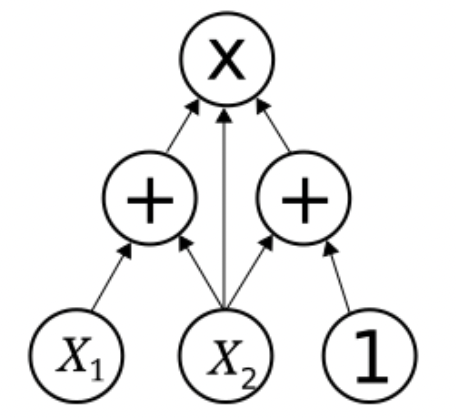

# About Arithmetic Circuits

[Arithmetic circuits](https://en.wikipedia.org/wiki/Arithmetic_circuit_complexity) consist of a collection of wires and gates, where the wires hold [elements of a finite field](about-finite-fields.md) and each gate computes either finite field addition or finite field multiplication.
In contrast, in an [electronic circuit](https://en.wikipedia.org/wiki/Electronic_circuit), the wires either contain electrical signal or they don't, and each gate may compute a variety of logical operations.

Arithmetic circuits are central to zero-knowledge proof techniques: SNARKs and STARKs prove integrity of an execution of an arithmetic circuit.

## Arithmetic Circuits as Polynomials

Because arithmetic circuits consist only of addition and multiplication, the circuit can be translated into a polynomial. In other words, the output(s) of the circuit can be expressed as a multi-variate polynomial, $C(x_1,\ldots,x_n)$ where

- $n$ is the number of inputs to the polynomial, and
- the degree of $C$ is bounded by the number of multiplications in the circuit.

The circuit pictured above can be written as $C(x_1, x_2) = (x_1+x_2)\cdot x_2 \cdot (x_2+1)$. This simple example is drawn from [Wikipedia](https://en.wikipedia.org/wiki/Arithmetic_circuit_complexity).

## Two Approaches to Building with ZK

- Option 1: Build app-specific arithmetic circuits
- Option 2: Build on top of a zero-knowledge virtual machine, which receives a binary file as an input and outputs a proof of execution.

At RISC Zero, we adopt the latter approach: we've written a [RISC-V circuit](https://docs.rs/risc0-circuit-rv32im), which emulates rv32im.
The rv32im circuit receives a RISC-V binary and some user specified input, and generates an [execution trace](../proof-system/what-is-a-trace.md).

If the execution trace is valid, the [Prover](https://docs.rs/risc0-zkvm/*/risc0_zkvm/trait.Prover.html) generates a [receipt] that can be [verified] by a skeptical third party.

## RISC Zero's Circuits

In addition to the rv32im circuit, we have built:

- an accelerator circuit for SHA-256
- a recursion circuit, which receives two receipts and produces a single recursion receipt.

## Additional Resources

- Wikipedia page on [arithmetic circuit complexity](https://en.wikipedia.org/wiki/Arithmetic_circuit_complexity)
- [From programs to arithmetic circuits](https://www.youtube.com/watch?v=0M0pAubEjz8\&list=PLBJMt6zV1c7Gh9Utg-Vng2V6EYVidTFCC\&index=4): YouTube video from David Wong

[verified]: https://docs.rs/risc0-zkvm/*/risc0_zkvm/struct.Receipt.html#method.verify
[receipt]: https://docs.rs/risc0-zkvm/*/risc0_zkvm/struct.Receipt.html
